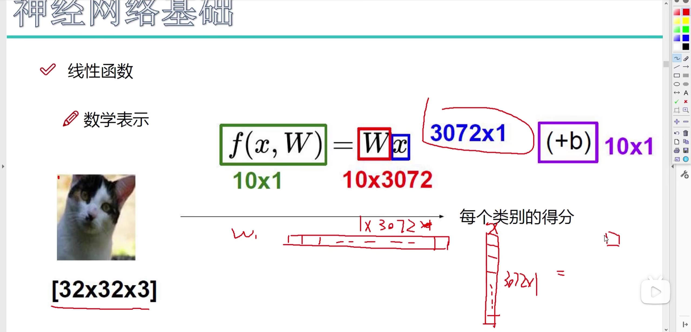
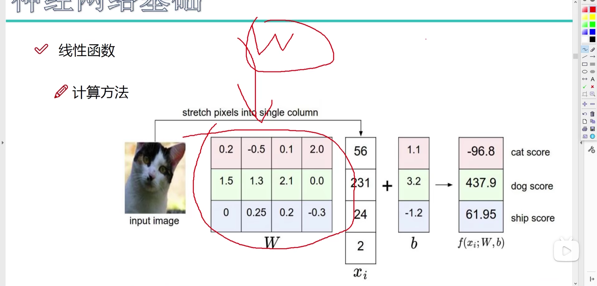
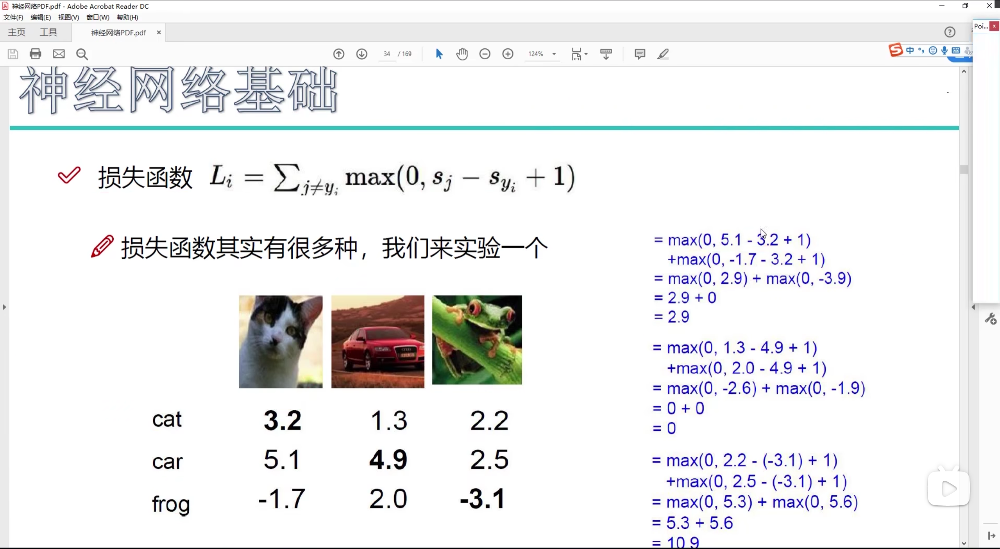
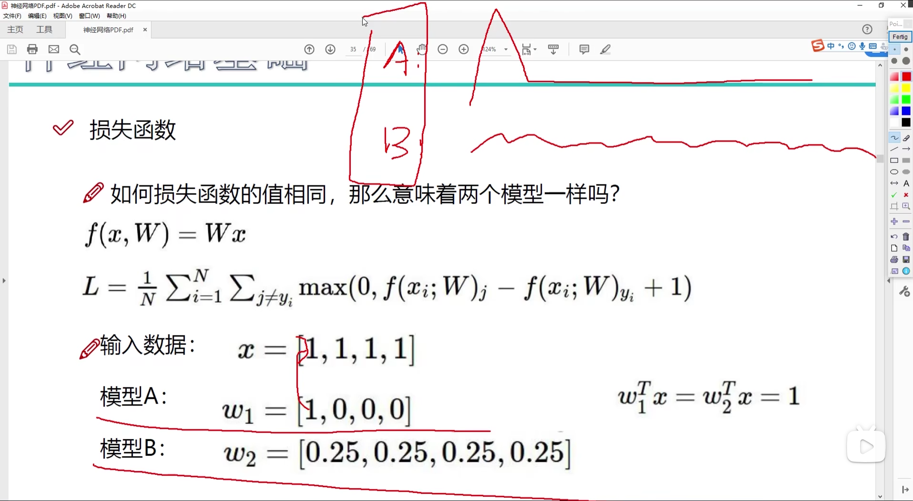
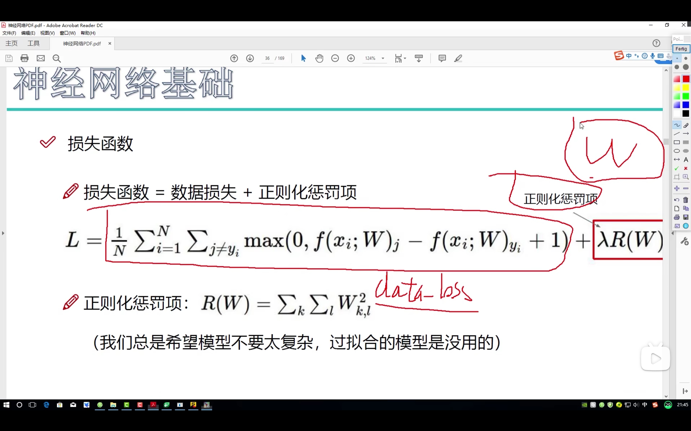
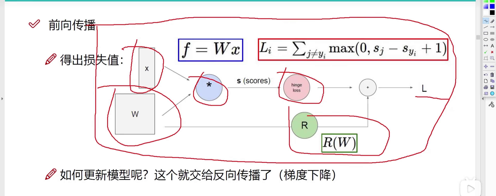
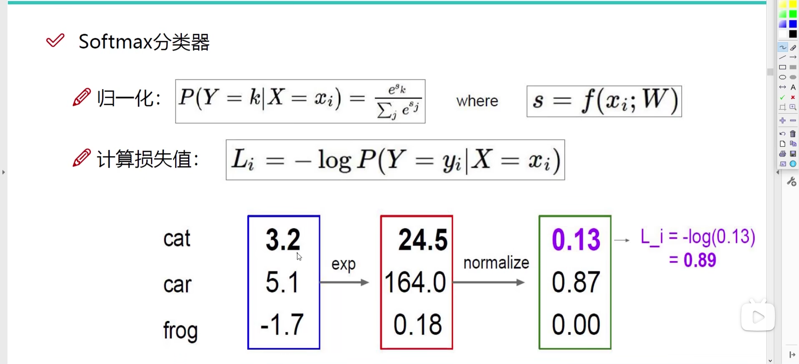
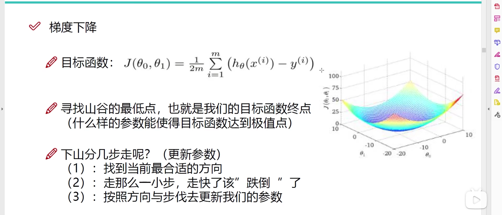

# 得分函数

## 举例

在图像分类问题中，我们需要把一个图像划分为多个可能的类别，比如说我们需要判断图像是否属于x个类别的其中一个，这时候我们就需要通过得分函数来判断，即对于这个图像算出一个x维的向量（矩阵），选取最大值的那个类别作为分类的结果。

那么现在问题来了，如何计算一个图像整体的得分呢？

可以知道的是，图像由像素点组成，如果要得出图像整体的分数，那么我们可以计算这个图像所有的像素点的得分，最后得到图像整体得分。

具体来说就是对于每一个像素点，我们都去计算出这个x维的向量，也就是判断每一个像素点的x分类可能性，最后再总和到一起来得到整体的答案

则最终的结果就是一个$1\cdot x$的向量

$f(x,W) = W\cdot x + b$

其中W为决定性参数，即为权重，等于$[t \ s]$，大小是$t \times s$，s是像素点个数，t就是要划分的类的个数，x等于$s\times 1$大小的向量，RGB三通道还是算成一维的。b则是微调参数，与$f(x,W)$大小格式一样，当然可以是主观参数，也可以是客观参数

# 损失函数

## 举例

计算出了最后的$f(x, W)$值之后，发现分类的结果与真实结果有偏差，这个时候就需要更新W参数，这个时候就需要用到我们的损失值

计算损失值的方法有很多，这里以该例子来看：

这里对于每一张图像都得到了分类的权重，这个时候我们来计算正确分类的那个权重与其他错误分类权重的差值总和（去除负值），再加上我们手动设置的容忍程度1，即至少要看出大于1的权重差才能算是没有损失，这样我们就可以简单的计算出损失值

# 正则化惩罚项

当两个模型算出来的损失值相同时，我们还有其他的一些指标来评估好坏，如图中的A、B模型，虽然二者算出的损失值相同，但是很明显A出现了过拟合，我们需要避免这种情况的出现，则我们加入一个正则化惩罚项

这个正则化惩罚项针对模型W本身，不和输入项x有关，通常来说可能是和方差有关，或者说是和极值差有关，能够限制模型的参数分布不会过于集中

最后根据这个式子我们可以得到真正的损失值（前向传播）：

那么更新模型W则需要减小损失值，也就是梯度下降（反向传播）

上面的损失函数较为简单，不常用，一般常用Softmax分类器得到损失函数

这里将我们得到的得分值转换为概率（sigmoid函数）

这里属于机器学习的基础，就不多再赘述

具体来说就是将得分先进行指数放大，然后计算出相应权重的比例，之后取对数进行归一化

# 反向传播计算方法

主题思路就是通过L得到新W，

还有其他的方法来反向传播：

1. **随机梯度下降（SGD）**：虽然通常将SGD视为梯度下降的一种特殊形式，但在实践中，它通过在每次更新中仅使用一个训练样本来降低计算成本，而不是使用整个数据集的平均梯度。
2. **动量（Momentum）**：这种方法添加了一个动量项到SGD中，有助于加速SGD在相关方向上的收敛并抑制震荡，通过考虑过去梯度的加权平均来实现。
3. **Adagrad**：这种算法通过调整学习率来适应参数，对于每个参数，它都会调整其学习率，适用于处理稀疏数据。
4. **RMSprop**：解决了Adagrad学习率不断减小可能导致训练提前终止的问题。它通过使用梯度的平方的移动平均来调整每个参数的学习率。
5. **Adam（Adaptive Moment Estimation）**：结合了Momentum和RMSprop的优点，它存储了过去梯度的指数衰减平均值（第一矩估计）和过去梯度的平方的指数衰减平均值（第二矩估计），以计算每个参数的自适应学习率。
6. **Nadam（Nesterov-accelerated Adaptive Moment Estimation）**：结合了Nesterov加速梯度（NAG）的概念和Adam的方法。这种方法在某些情况下可以提供更快的收敛。

**Adam**方法是目前最好用的反向传播方法