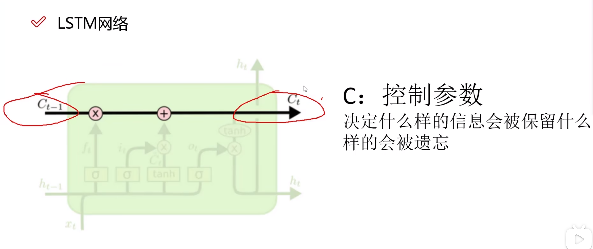

# 递归（循环）神经网络RNN

循环神经网络在卷积神经网络的基础上加入了时间序列

**即前一个时刻训练出来的结果特征也会对后一个时刻的训练产生影响，从而使特征也呈现时间相关性**

CNN主要运用在CV方面

RNN主要运用在NLP自然语言处理方面

详细介绍

每一个$X_t$代表了一个时间点的数据，经过A计算后得到$h_t$中间结果，假如说我们要获取到t时刻的网络参数，则我们也需要$h_t$以及最后的A，注意到图中A在每一次$X_t$输入后都会参与变化，以联系到新的时刻，我们也不需要$h_t$之前的值，只需要最后的训练结果就行。

## LSTM网络

RNN的时间跨度太长了，随着t值增加，它将之前所有时刻的值都用上了，量也会变大，误差也会叠加。

LSTM网络则可以选择性忘记一些信息

