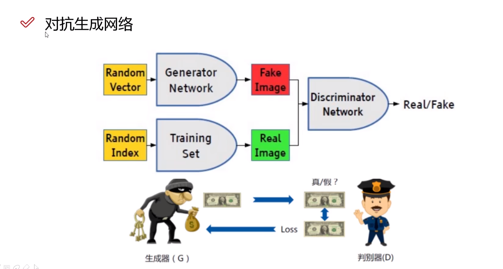

# 对抗神经网络

用于图像风格转换、由原始数据输入生成相似数据

超分辨率重构（电影超清重制版）、图像修复

**生成器用于生成数据、判别器用于比较并计算loss损失值，二者同时进行迭代，最后生成器生成越来越逼近原始数据**。

二者同时进行“竞争”，生成器生成越来越逼真，判别器识别也越准确

生成器输入为Random Vector，一般是100维的向量，之后将这个向量进行转换和生成，这部分可以用传统网络和卷积网络实现，输出为“假”数据，有了这个假的数据就和“真”数据（来自数据集）进行比较，实现二分类输出Real或者Fake，这一步由判别器实现。

在生成器生成部分，假如是图像，用的是卷积神经网络，最后输出格式应该确定为s×t×3，也就是图像格式。

## 损失函数

使用BCELoss，所有的预测结果先映射到0到1之间，

得到了对应预测结果的映射值，带入相应实际的标签进行计算。

## 生成器

一开始的时候，生成一个随机的特征值，也就是初始化向量

之后定义神经网络每一层的特征大小，和神经网络层数，最后得到的特征个数一定是和原始数据一致的。

## 判别器

这时候输入到判别器的数据就是生成器生成的结果，这个数据作为假数据传入，同时原数据集的数据以真数据标签传入

这时候的损失函数：生成图像传入判别器的时候标签是1，也就是真数据，因为我们希望生成的数据能瞒天过海骗过判别器

但是判别器需要把原来标签为1的数据判别成0

real_loss将真实的数据传入，希望把这些数据判断成真的

fake_loss将生成的数据传入，希望把这些数据判断成假的

# CycleGan

### 网络架构

我只能说妙啊，想出来这个模型的人太厉害了

这里因为A和B之间的风格不一样，相比于传统GAN，一个生成器没有办法真正验证准确性，那么这时候再加一个反过来的生成器，那么损失值就可以通过同类的图去计算，但是中间生成的fake img又可以去和真实图一起输入判别器去判断真实性

