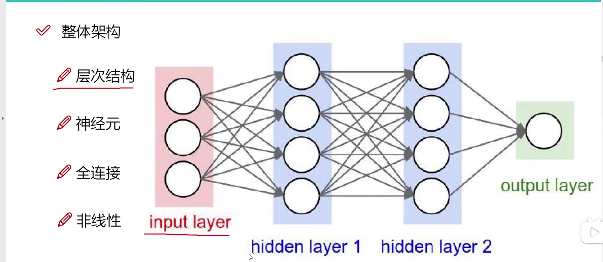
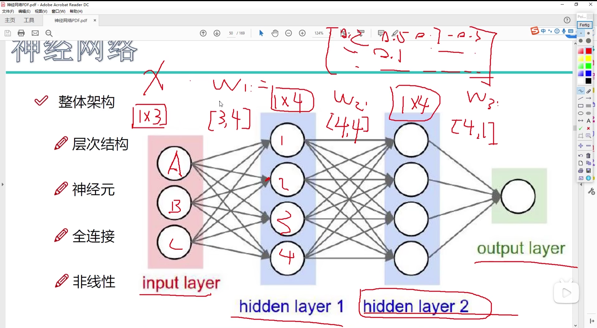
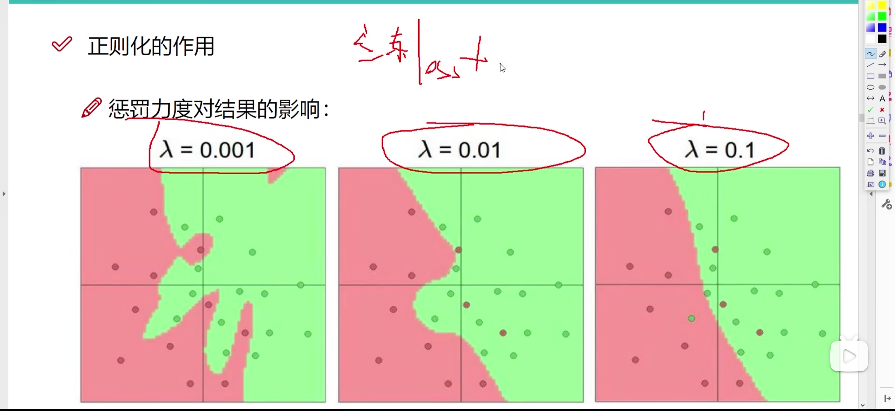
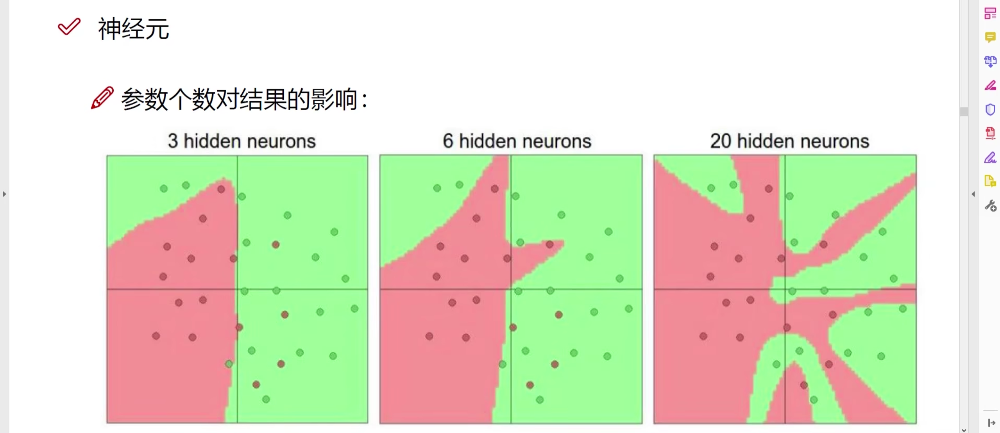
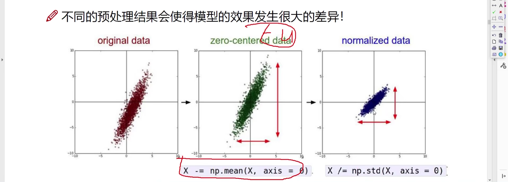
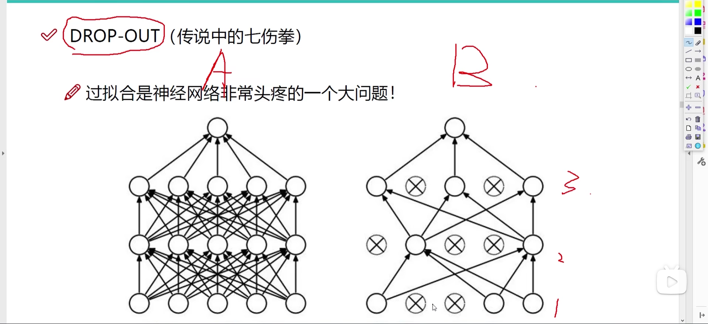
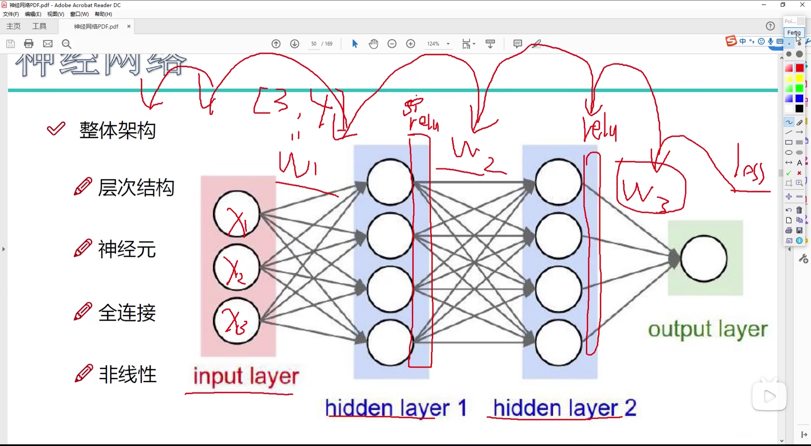

这里的batch就相当于是一次要训练的样本个数，一个的话就是$1\times t$，这里的t就是特征数

这里存在三个W，即每次递增layer之间的那一步操作

神经元个数越多，训练效果越好，但是其实参数量是以原参数倍数增加的。

这里参考机器学习中的VC-Dimension，分割数据点问题，当分割n维数据点时，至少多少维的线来分割

[ConvNetJS demo: Classify toy 2D data (stanford.edu)](https://cs.stanford.edu/people/karpathy/convnetjs/demo/classify2d.html)

正则惩罚力度对于结果的影响

参数个数对于结果影响

神经网络激活函数已经不再使用sigmoid，在极端值的梯度很接近0，几乎不更新，导致W的梯度消失

因此后来使用Relu激活函数

## 数据预处理

1. 去中心化`X -= np.mean(X,axis=0)`
2. 标准化`X /= np.std(X,axis=0)`

## 参数初始化

`W = 0.01 * np.random..randn(D, H)`

# 避免过拟合

除了用正则化惩罚来避免过拟合，也可以采用DROP-OUT方法

它的核心思想是在训练过程中随机地“丢弃”（即暂时移除）网络中的一部分神经元（包括它们的输入和输出连接）。通过这种方式，Dropout阻止了模型中的神经元共同适应（即过度依赖彼此的输出），从而促使每个神经元独立地学习有用的特征。

具体来说，Dropout工作机制如下：

1. **随机丢弃**：在每次训练迭代中，对于网络中的每个神经元，以一定的概率（通常是0.5，但这个值可以根据网络的不同层或不同的任务进行调整）将其临时从网络中移除。这意味着这些神经元在当前的前向和反向传播中不会参与计算和权重更新。
2. **缩放**：为了补偿被丢弃的神经元，训练结束时，网络的输出需要按照保留神经元的比例进行缩放，以保持活跃神经元的输出期望不变。然而，在实际实现中，通常是在训练过程中对保留下来的神经元的输出进行放大，而在测试时保持网络不变，不使用Dropout。
3. **测试时不使用Dropout**：在训练完成后，进行模型评估或实际应用时，不应用Dropout。此时，所有神经元都参与计算，但是其输出可能需要根据Dropout率进行适当的缩放，以反映训练过程中的平均激活。

# Summary

激活函数：

1. **用于隐藏层**：在神经网络的隐藏层中，激活函数用于加工从前一层传递过来的加权输入和偏置，产生输出到下一层。常用的激活函数包括ReLU（Rectified Linear Unit）、Sigmoid、Tanh等。
2. **用于输出层**：激活函数也用于网络的输出层，以确保输出符合特定的形式或范围。例如，在二分类问题中，通常使用Sigmoid函数将输出压缩到0和1之间，代表概率；在多分类问题中，Softmax函数将多个神经元的输出转换为概率分布。