## 卷积网络与传统网络的区别

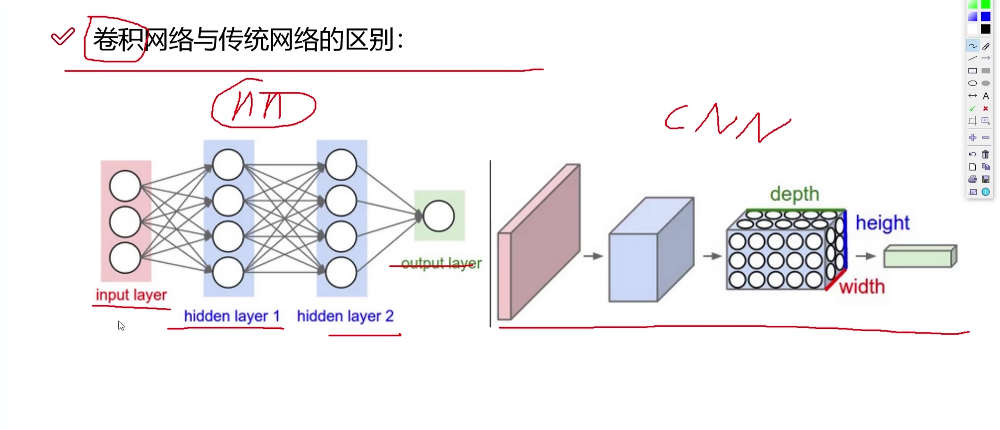

输入变成了有深度的

## 整体架构

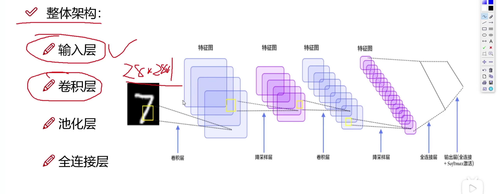

## 卷积

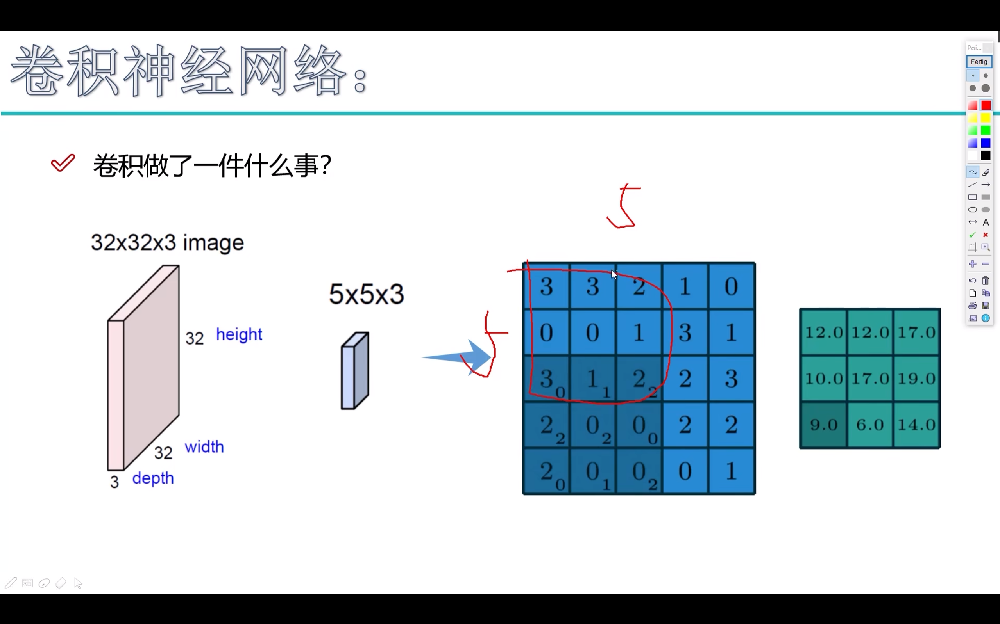

这里的$32\times 32\times 3$表示h、w、c，即表示图像的三个维度，最后一个c即为通道数，一般来说是RGB三通道

这里选取了$5\times 5\times 3$的卷积核用来卷积原输入数据，得到$5\times 5 \times 3$的区域（图中只包含了一个通道，实际是3层的。这里的卷积核的数值会随着之后的训练而改变，右下角标对应着W（卷积核），至于为什么是9个数一次计算呢？毕竟一个九宫格的中心正好对应一个数。之后再将这个区域进行卷积得到$3\times 3 \times 3$的矩阵结果，也就是特征图feature map（这里只对一个通道进行操作）

RGB三通道都要进行卷积操作，最后得到的结果做**加法操作**得到一个值

选取的卷积核大小代表了多大的区域得到一个卷积值

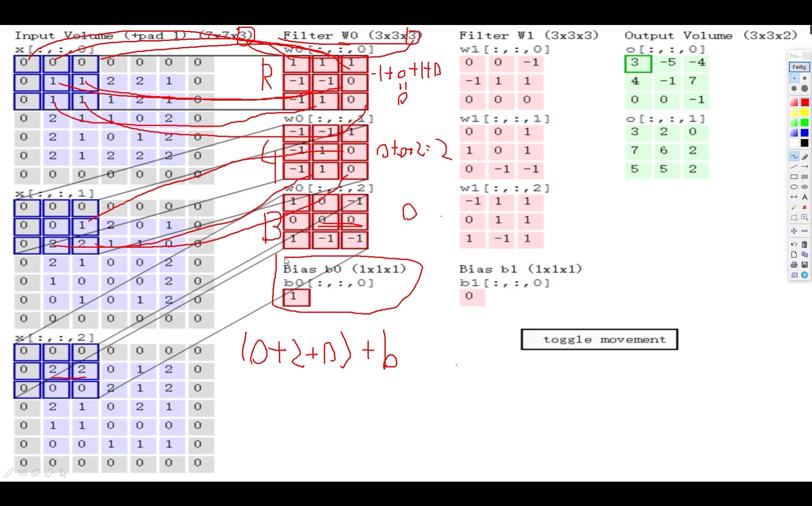

具体而言，首先将原输入分为三个维度，每个维度分别计算，这里大小为$7 \times 7 \times 3$的，但是注意到外围有一圈都是0，所以这里pad为1，这样做是保证数据训练的完整性。

对于$W_0$，我们初始化了三个矩阵卷积核，如图所示，可能为0，1，-1三个值，之后把这个卷积核和原输入数据的相应分割区域进行**矩阵内积计算（非直接相乘）**，这里得到的数相加，再加上偏置项即可得到原输入图像的$3\times 3$区域的特征值，即0+2+0+b，其中b为1，最后答案就是3，检查右上图的第一个数字为3

最后卷积核的数量也就代表了featuremap的层数

每次卷积中，不同的feature卷积核大小肯定是一样的，这样才能保证featuremap每层大小都一样

### 关于Input大小、Output和卷积核尺寸大小关系

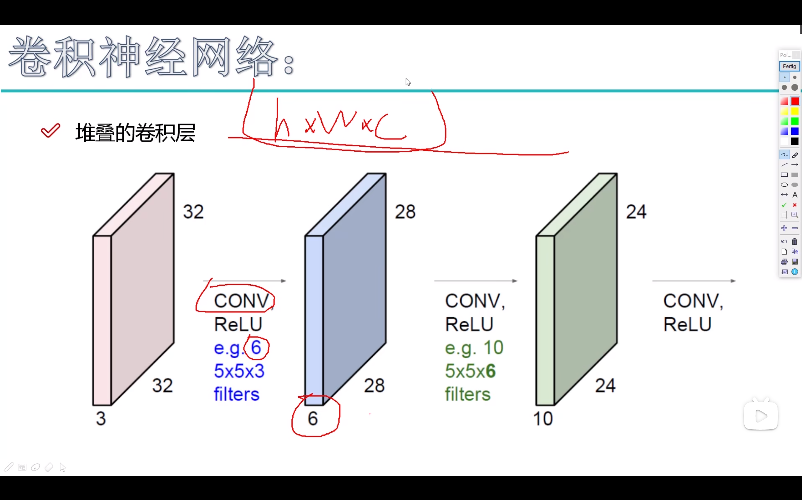

可见，卷积核的深度肯定是要和原输入的深度一致的，卷积核的个数决定了输出的featur map的深度

卷积层涉及参数：

1. 滑动窗口步长（即卷积核在原矩阵中每次移动的幅度）图像一般都是1就行，文本可能大于1
2. 卷积核尺寸（图像一般是$3\times 3$）
3. 边缘填充（padding）算在输入项大小就行，一般来说宽度小于卷积核尺寸。**输入维度+pad×2**
4. 卷积核个数

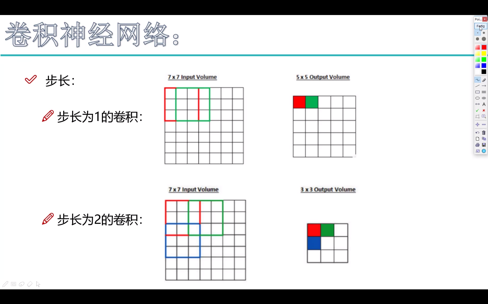

特征图大小计算公式：

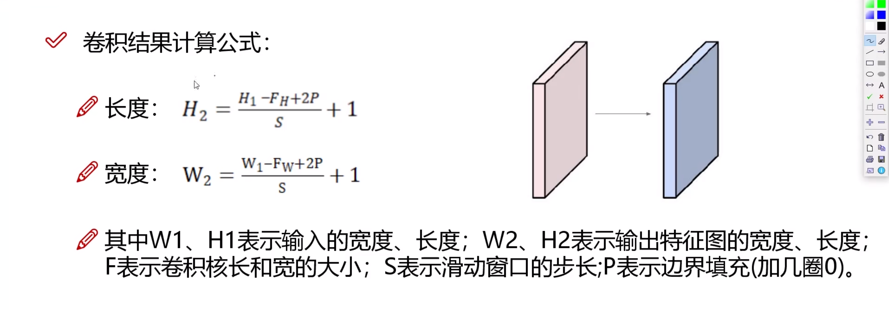

### 感受野

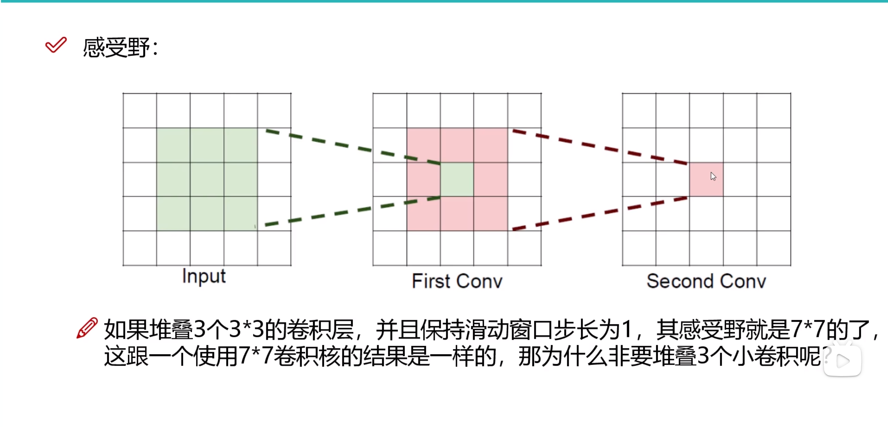

看到最右边的图，可以见到中间那个格子的值是通过中间First Conv的3×3矩阵区域计算而来的，而这个3×3的计算矩阵又是通过左图5×5的矩阵值得来的，则最右边的中间这个值的感受野就是5×5

通俗易懂的来说感受野就是感受到参与计算的值的范围

感受野还是越大越好，相对来说感受的数据较为广泛，避免过拟合

对于题中问题：

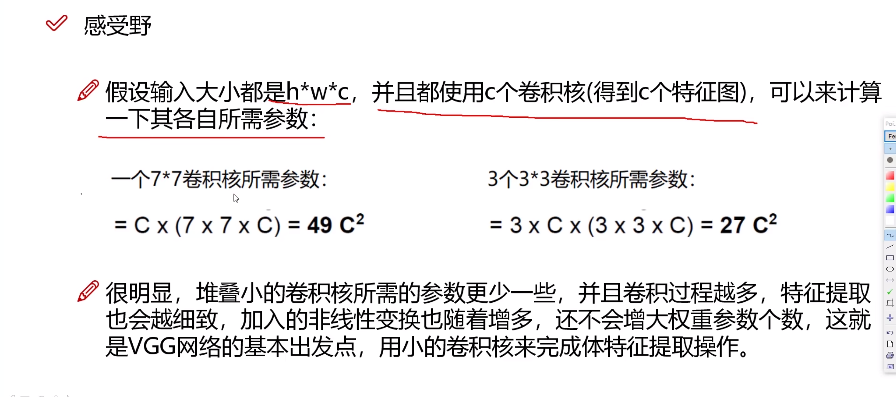

## 卷积参数共享

对于卷积过程，一次卷积时卷积核并不会发生变化，总参数量等于$\Sigma (每个卷积核自身的大小)+偏置参数$，这里的偏置参数大概率是卷积核的个数

相对来说大大减小了神经网络中的参数值，如果说是全连接网络中每一个像素点对应一个参数，那就太大了。

# 池化层

在得到了特征图之后，可能参数量还是比较庞大，则我们就需要池化层来提取较为有用的一些参数

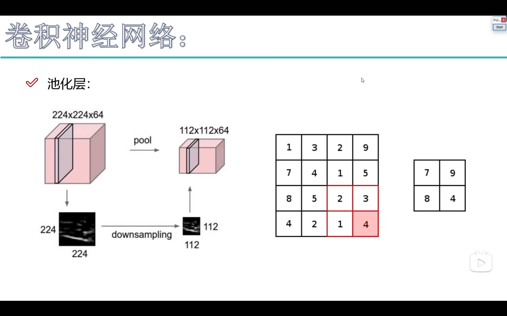

注意池化层会压缩每一层feature map，但是并不会减小feature map的层数。

如右图所示，这里对于每一个$2\times 2$的矩阵，提取出了一个最大的数（举例为MAX POOLING，也有其他的压缩方法AVERAGE POOLING）来代表这个矩阵，最后将$s\times s\times d$的数据压缩成了$s/2\times s/2\times d$的数据。

为什么选大的值？因为这里的值相当于是重要性，神经网络只需要最好的特征，MAX POOLING简单直接而且是最好用的方法。

## 网络架构

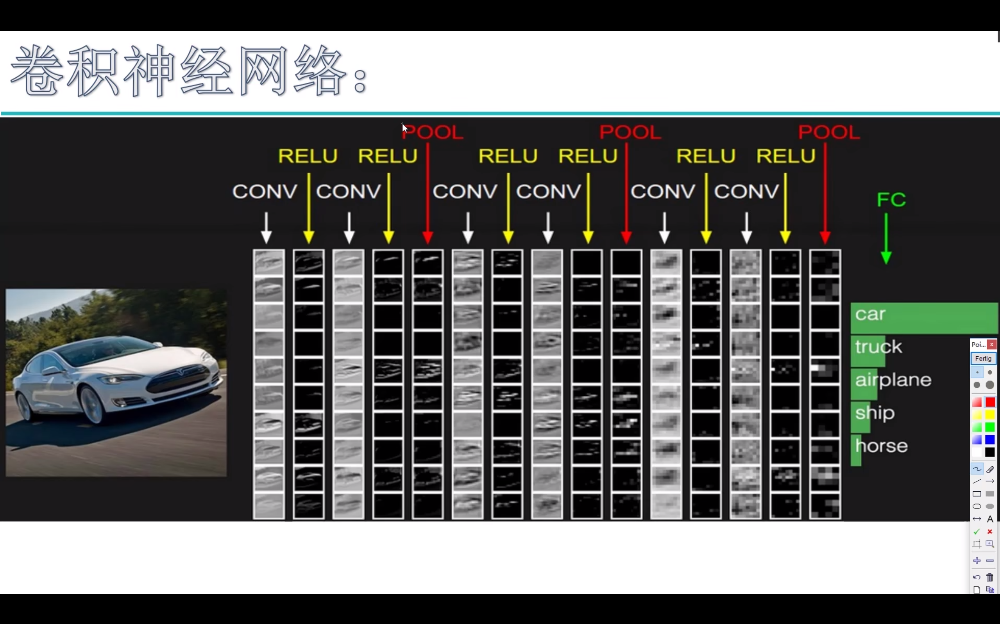

每一次卷积之后都会伴随一次RELU激活，每两次卷积过后会伴随一次池化，这也是神经网络最常见的架构

最后得到了特征图如何进行分类得到概率值？

那就是用全连接层了，但是这时候特征参数已经很小了。

但是最后的特征图（e.g$32\times 32\times 10$）并不能直接输入进去，注意到下图的神经网络input layer为一维向量，则我们需要把特征图转换为1维的，于是得到$1\times 10240$大小的一维向量，然后再转换为$1\times t$大小的概率，其中t为分类数

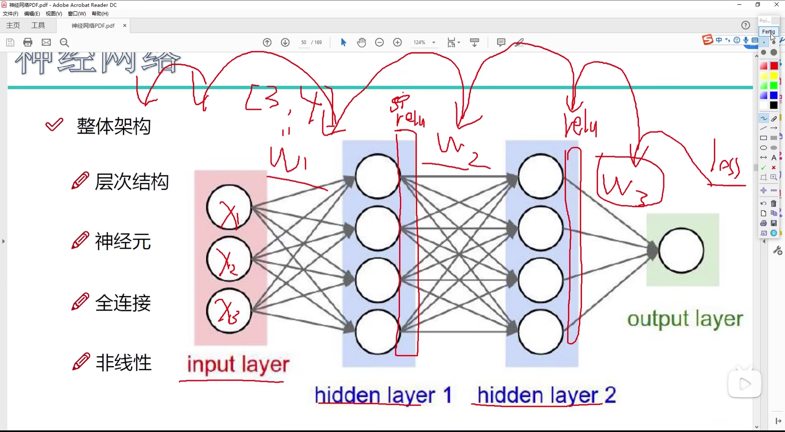

这一步叫做拉长

关于神经网络层数，每一次卷积conv算一层，relu不算，注意最后的全连接层也算一层，上图有7层。

### 特征图变化

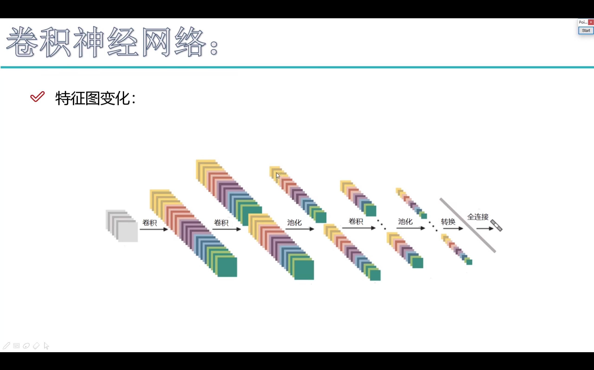

通常来说，每一次卷积会导致output大小略微减小，但是矩阵层数depth会增加，每一次池化大小急剧压缩，但是depth不变，以此类推，总体来说depth呈现逐步上升的趋势，矩阵面积呈现逐步减小的趋势，最后一层全连接，将一维向量大幅度缩小到分类数大小

## 经典网络Alexnet（12）

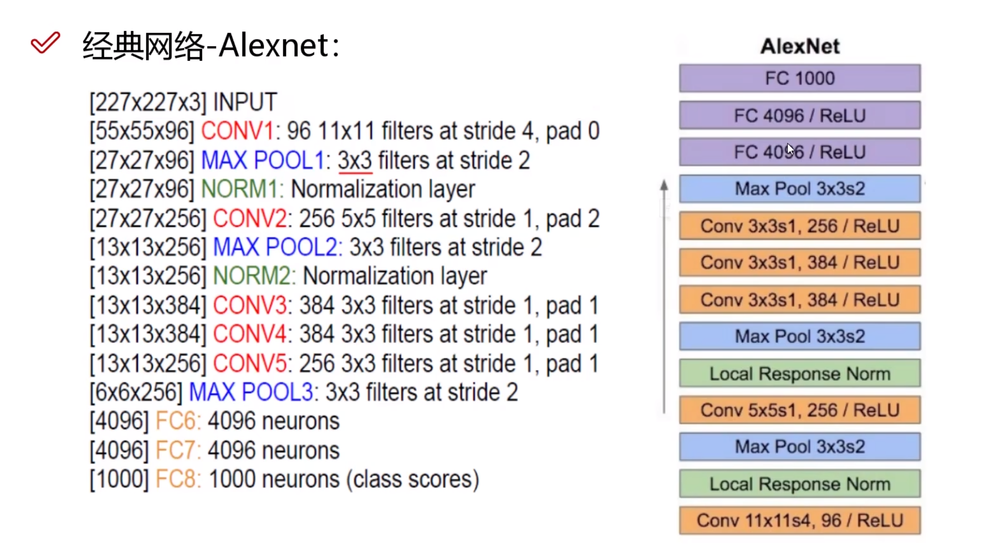

问题：conv1太大，stride1也太大了，无pad。LRN层被证实没有用

## 经典网络-Vgg（14）

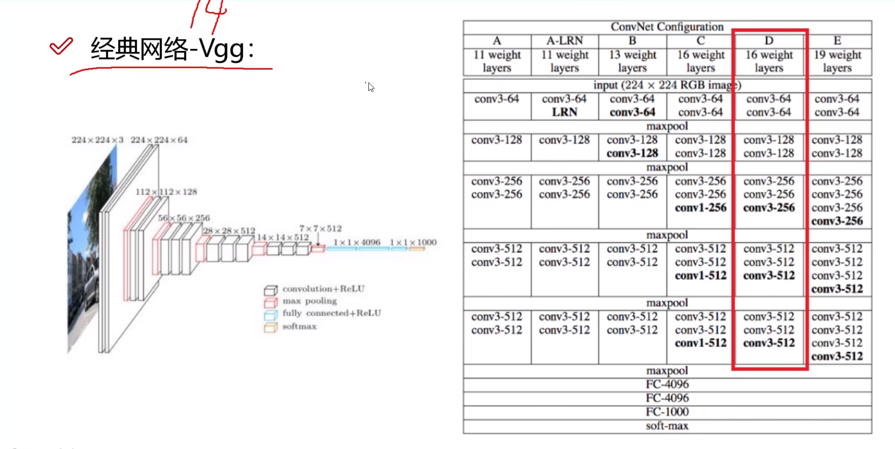

红框D版本较为常见，改进了卷积核大小为3

为什么是16？因为在实验中发现16层的结果比更大层数效果要好

## 经典网络-Resnet（15）

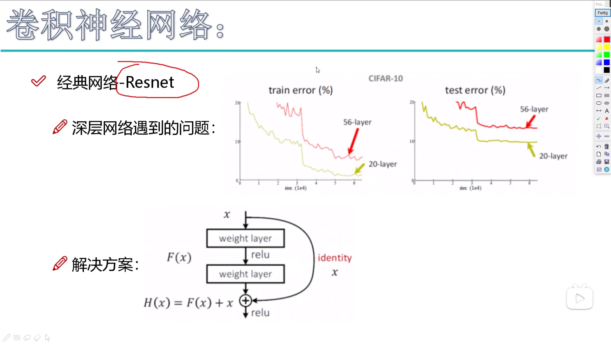

该网络也称为残差网络。

在之前的一些神经网络训练中，层数增加可能导致train error反而增加，因为可能是有些错误的层导致后面的层也一错再错

解决方案：将中间错误的层抛弃，把连接层跳过该层

在图中，我们额外加了一个同等x映射，F(x)与x比较，好的话就使用，不好的话还是沿用之前的x，相当于是这两次卷积不需要了，回到卷积前的数值。

**卷积神经网络首选Resnet**