# 自然语言处理-词向量模型-Word2Vec

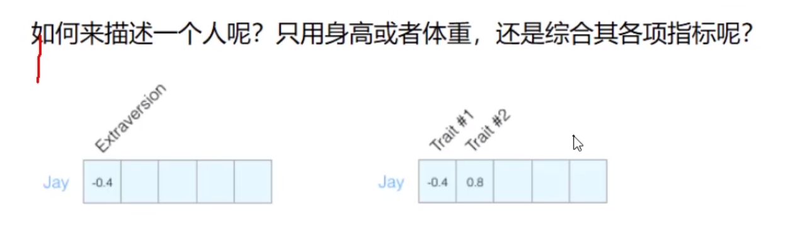

对于一个人，我们可以通过很多指标来定义他

对于词来说，也是同样的道理，一个词向量大小大概在50~300维的。

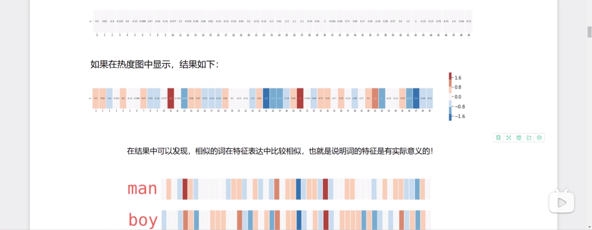

这里可以发现，相似的词的特征向量是比较相近的，不相似的词的特征向量相差也比较大

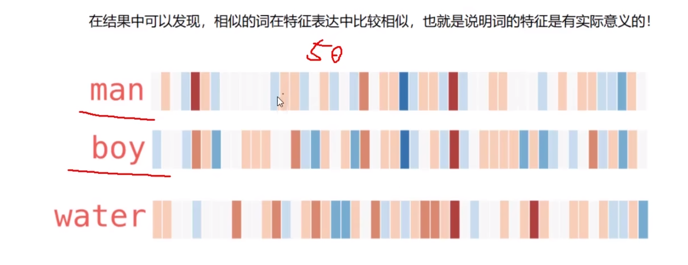

## 训练词向量模型

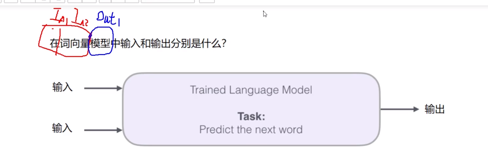

本质上来说还是在预测下一个词可能是什么

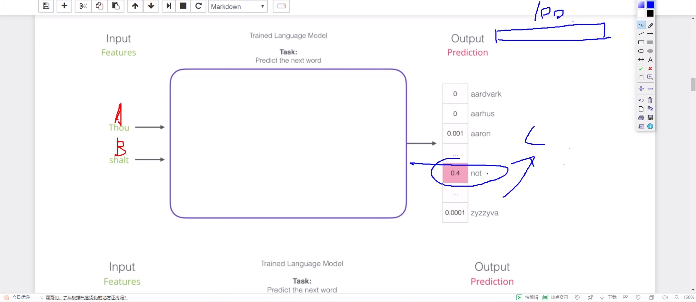

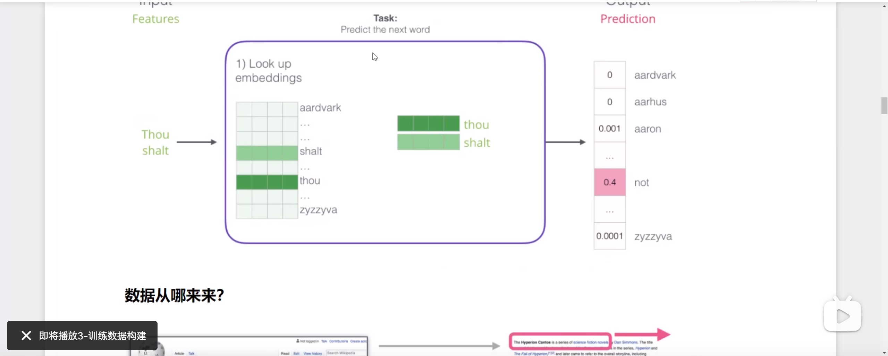

具体来说，就是先通过查找原本词汇表的每个词的向量，得到一个初始的向量，之后随机生成权重，进入神经网络训练，通过不断地迭代来更新向量，最后得到最佳预测结果

## 数据集构建

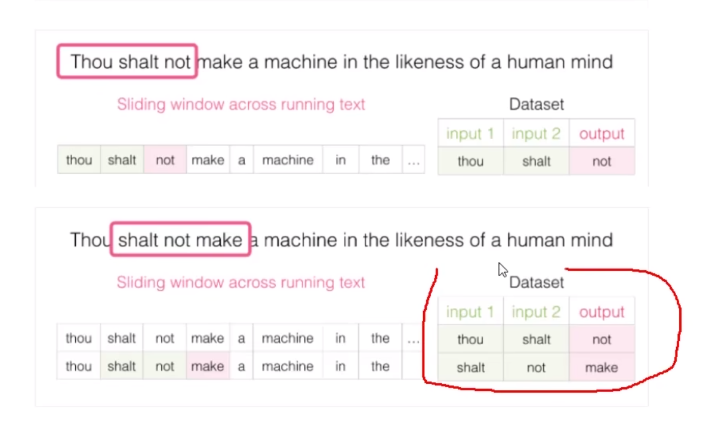

通过input和output（滑动窗口）的循环滚动，可以实现训练数据的构建。

## 模型对比

CBOW模型

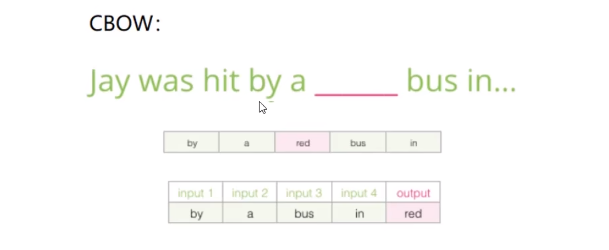

通过上下文的输入来预测中间的词

Skipgram模型

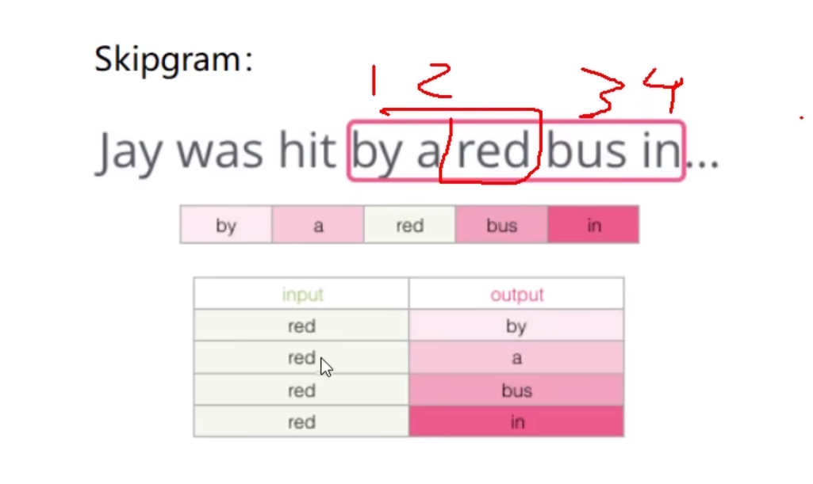

通过一个词的输入来预测上下文的模型

工具包使用Gensim库

在训练的过程中，不仅更新W权重，还会更新输入本身，因为本身的向量也发生了改变

但是训练的结果如果变成概率分布的话，可能是非常庞大的，包含了语料库中的所有词的概率，这对于softmax步骤来说计算量过于庞大。

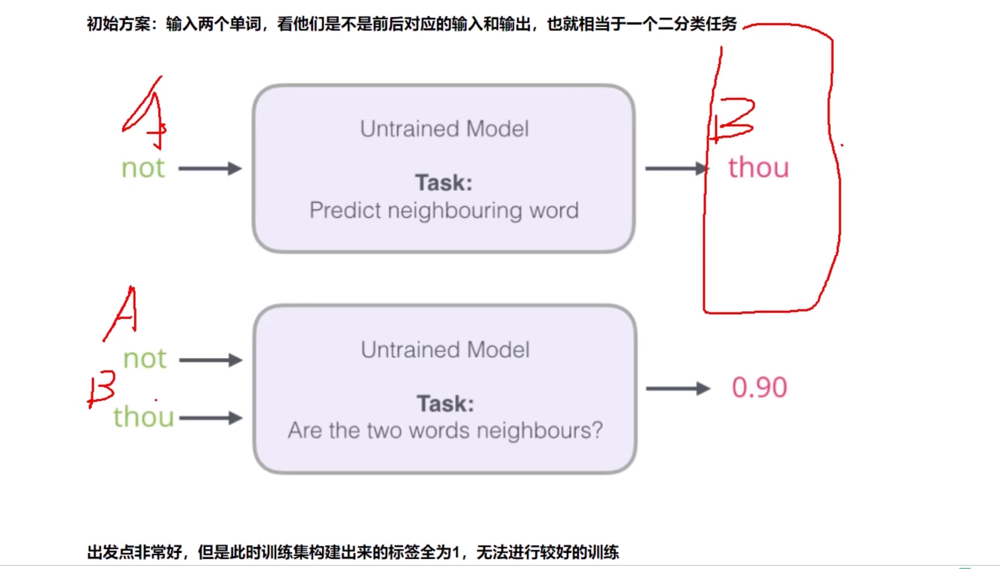

解决方法就是改变训练的输入输出，我们直接把两个词都输入，输出就是它们为临近词的概率，最后变成0或者1，相当于是把极多分类变成二分类

### 负采样模型

关于最后输出0和1，我们需要控制1的个数，于是需要排除掉一些词，这个时候我们就需要通过负采样模型去实现

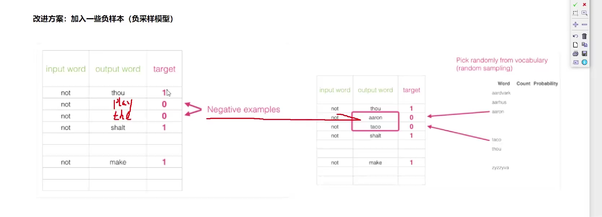

负样本是人为创造出来的

负采样个数大概在5个左右比较合适

Gensim推荐

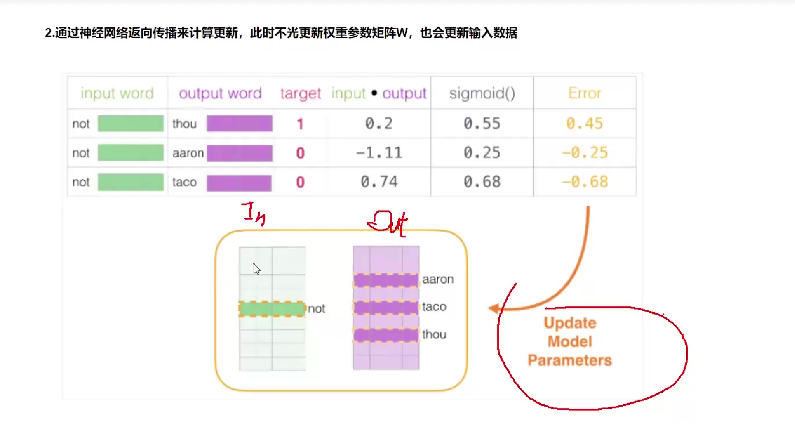

样本的输入包括Embedding和Context两个，分别对应训练中的输入和输出，当然毕竟我们是二分类，所以二者本质上都是输入，但是这边还是需要区分一下的。

