# Transformer

transoformer具体在做什么事情？

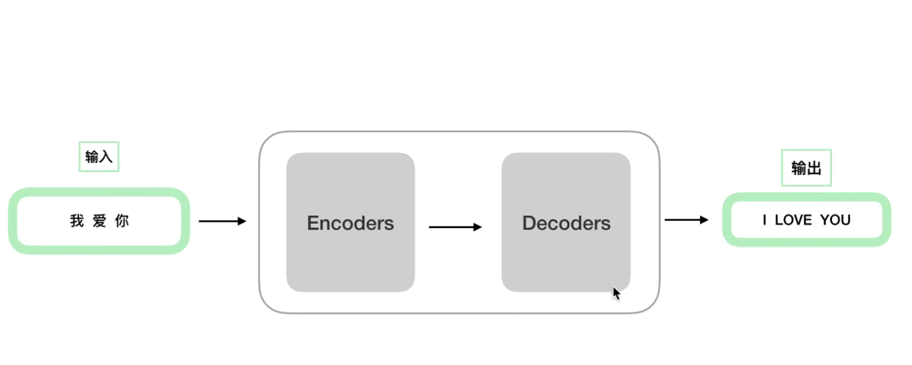

Transformer分为编码器和解码器，且在模型中包括多个encoder和多个decoder组成，encoder和decoder的数量相同，encoder的结构相同，但是他们的参数不相同，在训练的时候同时独立训练他们，decoder同理。

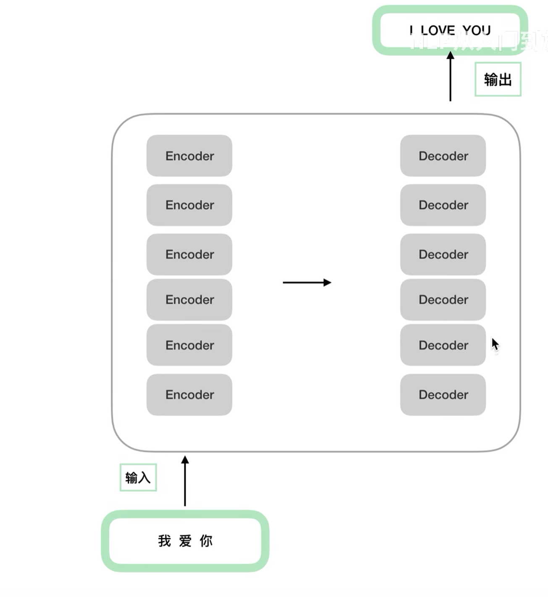

## 原理架构

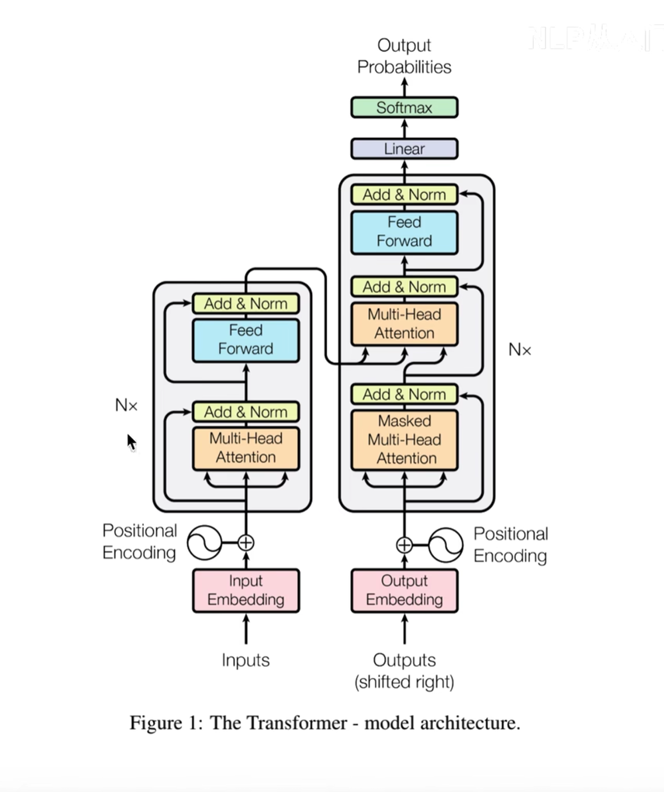

## encoding

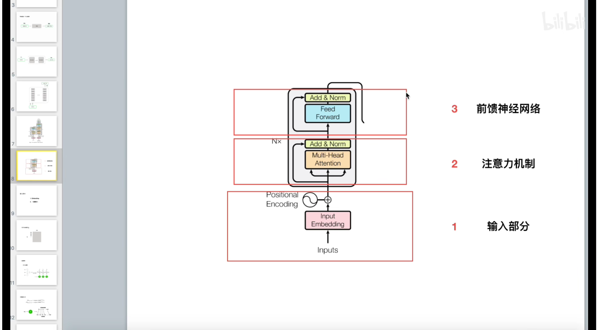

### Input Embedding

### 位置编码

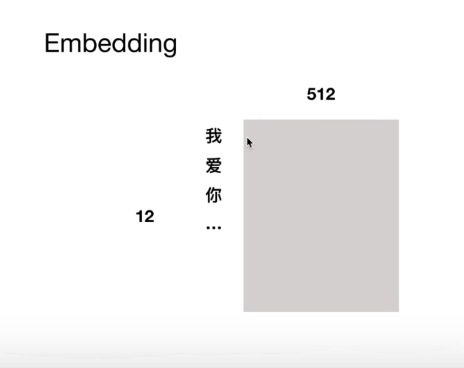

我们将一个句子中的每一个字定义成一个vector，这里与word2vec是相同的

为什么需要位置编码？

在RNN中，我们的隐藏层按照时间线展开，处理过程有一定顺序性，但是在Transformer中，可以同时处理所有的信息，这样提升了速度但是忽略了单词之间的序列关系

### 位置编码公式

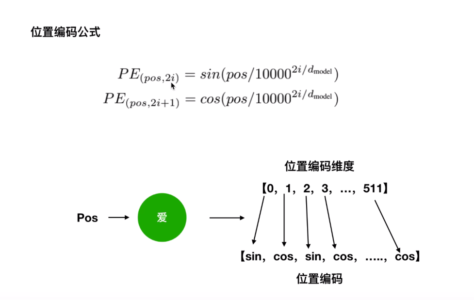

例如句子中的“爱”

假设这个单词有个512长度的向量表示，那么则位置编码维度就是从0到511，我们对相应奇数或者偶数位置运用sin或者cos函数，奇数用cos，偶数用sin，带入上述公式

之后将位置编码和词向量编码相加

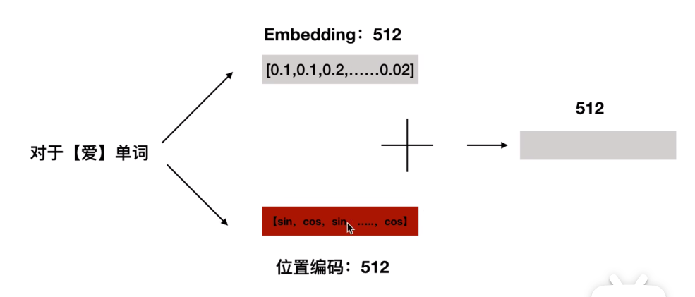

也就得到了最终的向量作为Transformer的输入

### 为什么要用位置编码？

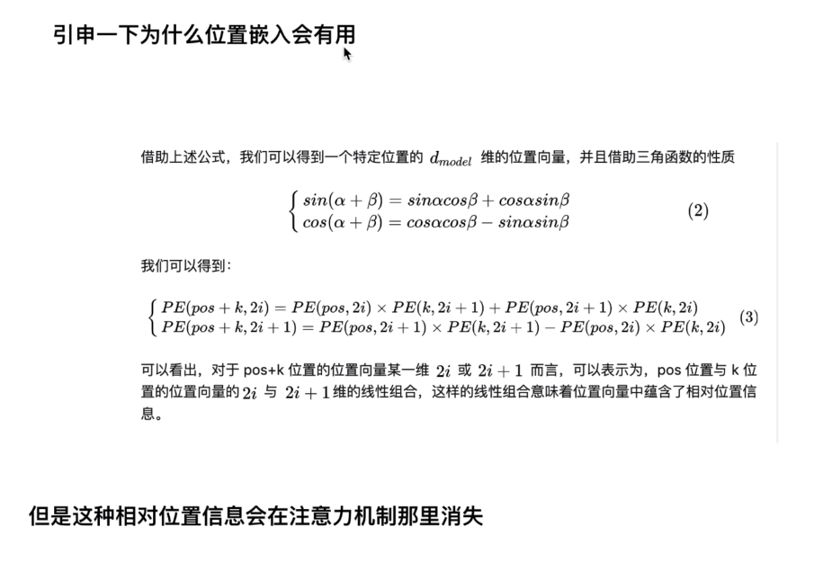

这里代表的是一种绝对位置信息代表了相对位置的信息，保留了词与词之间的关系

## 注意力机制

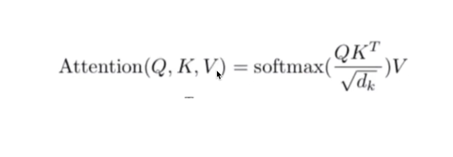

注意力机制会用到三个矩阵，QKV，这里的$d_k$为qk的维度

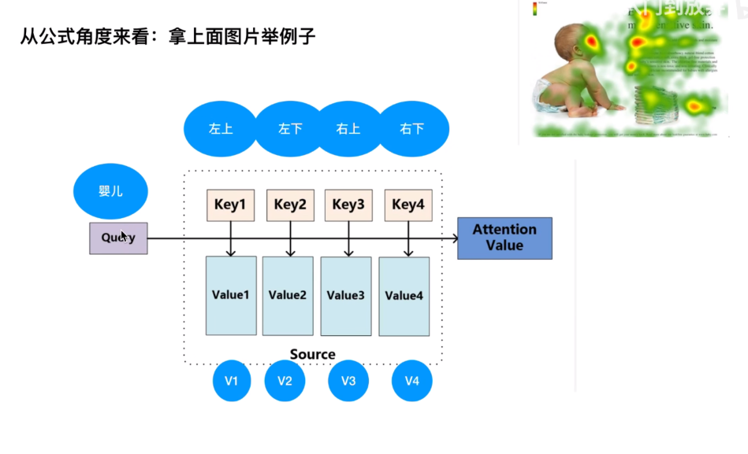

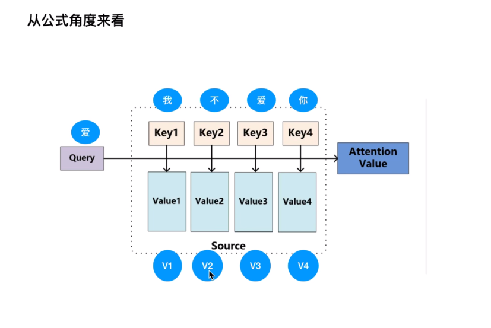

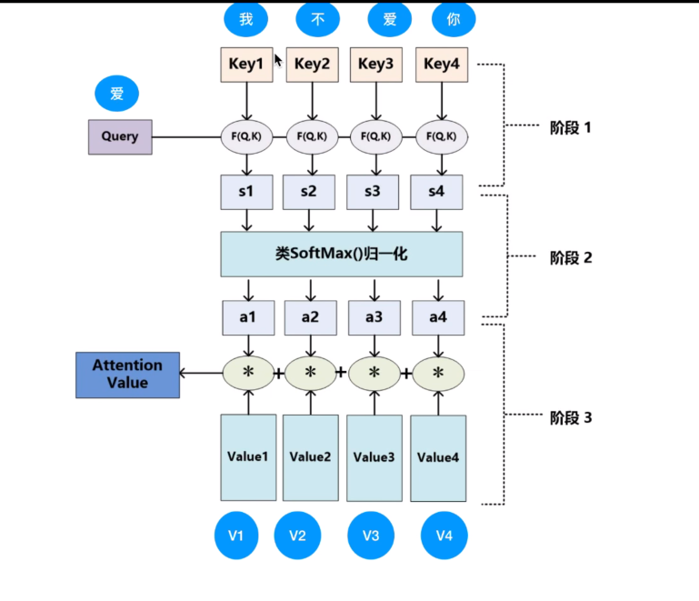

如何获取QKV？

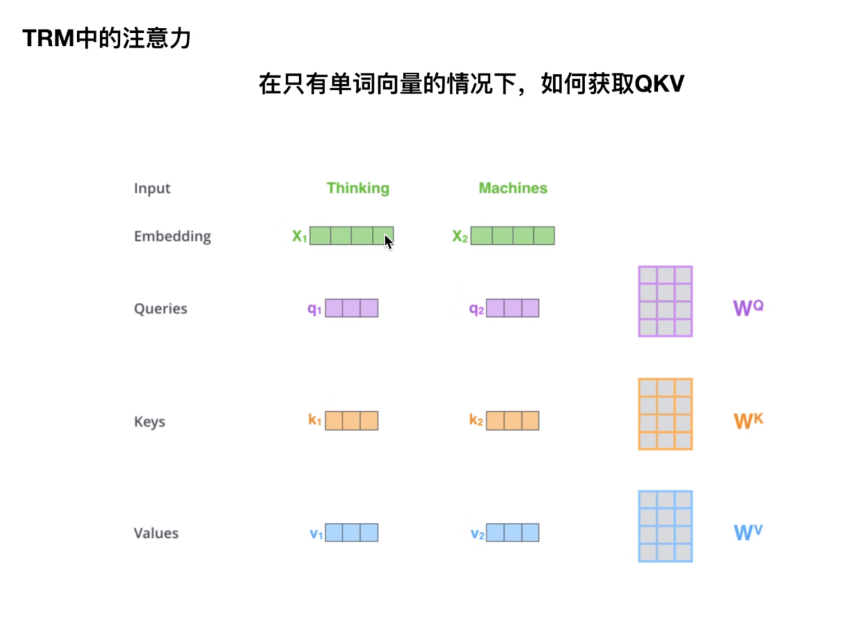

q，k，v分别由Embedding X乘$W^G$和$W^K$和$W^V$得到

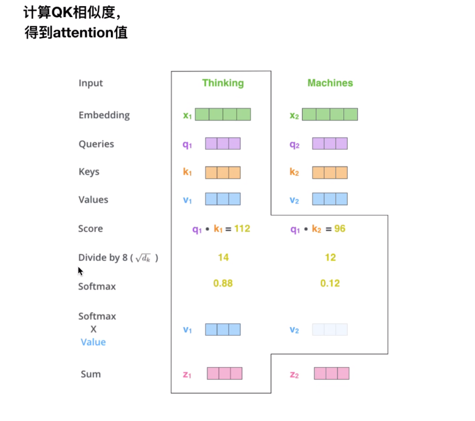

之后用q×k得到一个score，也就是公式中的$QK^T$，之后除以$\sqrt{d_k}$，softmax后乘以v后，将各个attention头的值相加得到结果，这样子可以保证所有的头发现的信息都能被考虑到

为什么除以$\sqrt{d_k}$，为了保证方差在1，同时QK相乘值很大，除以该值防止梯度消失。

在输入的过程中是所有的单词一起输入，也就是说计算的时候每一个头的公式都是以矩阵来计算的，当然不同的头也有不同的参数，最后相加以全部利用。

## 残差

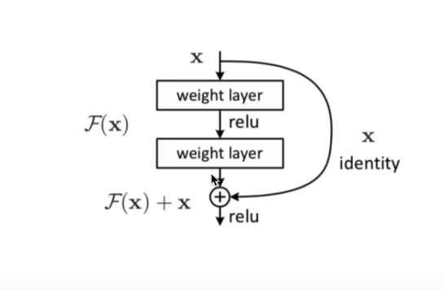

## Decoder

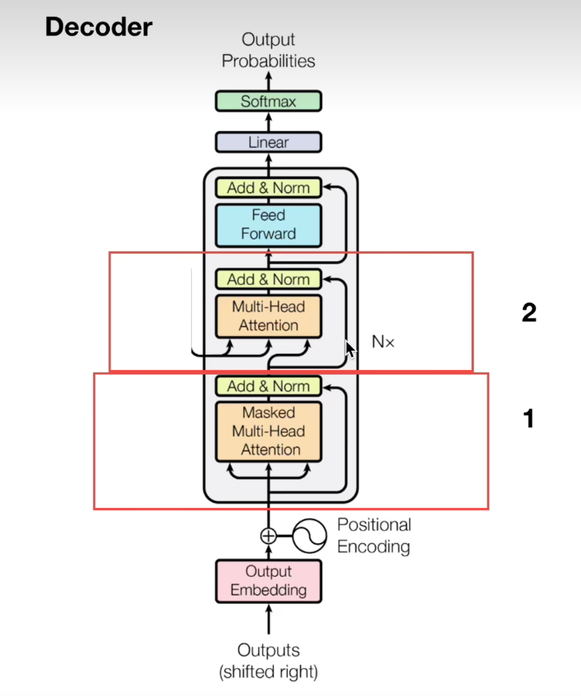

Decoder前面的Masked Multi-Head Attention是为了保证训练过程中注意力头不会看到未来的信息，即要预测的词的后面的信息，只能看到其之前的信息。第二层多头注意力机制的输入来自编码器的K,V，最后输出K的概率向量，并实现预测。

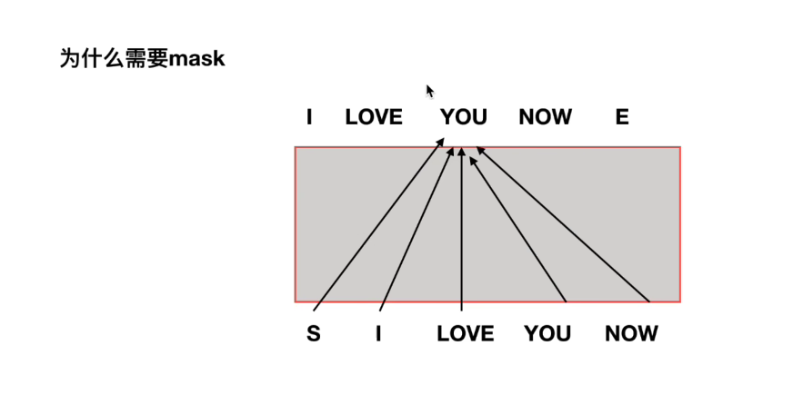

如图所示，如果我们需要预测You，则在训练过程中本身you以及之后的单词就不能够用到，这里就要把Now和you去掉。

之后是第二个多头注意力机制

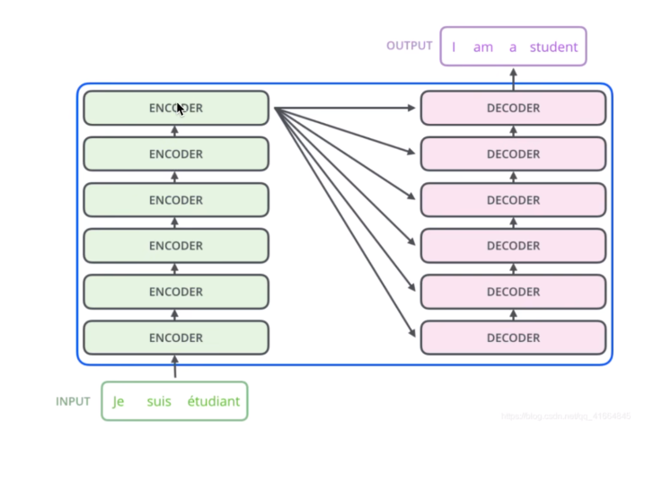

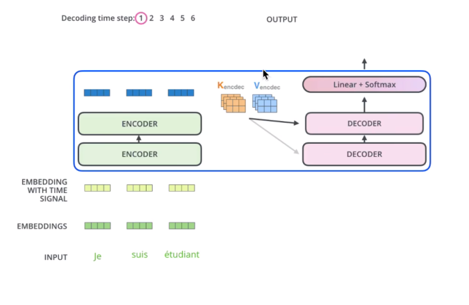

encoder得到的K和V传入Decoder作为输入，以相同的过程计算得到结果并进行Softmax处理获得最终概率值
