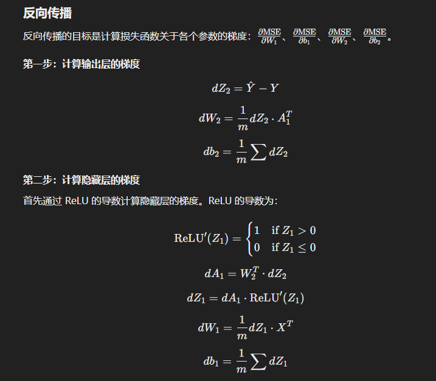

# 正则化和优化

## 目标函数(Objective Function)

目标函数是指在优化问题中需要最小化或最大化的函数。它衡量的是模型的预测与实际结果之间的差异。目标函数在机器学习中的常见形式包括损失函数和成本函数。

**常见的目标函数类型**：

1. **均方误差 (Mean Squared Error, MSE)**: 常用于回归问题，计算预测值与实际值之间差值的平方和的平均值。
2. **交叉熵损失 (Cross-Entropy Loss)**: 常用于分类问题，计算预测概率分布与实际类别分布之间的差异。
3. **对数损失 (Log Loss)**: 也用于分类问题，特别是二分类问题。

### 局部最小 (Local Minimum)

局部最小是指在某个区域内，目标函数值比周围所有点的函数值都要小的点。局部最小并不一定是全局最小，但在局部范围内它是最低点。

**概念**：

- **局部最小值**: 函数在某个点附近的值小于这个点附近其他点的值。
- **全局最小值**: 函数在整个定义域内的最小值。

### 目标函数的作用

目标函数的主要作用是：

1. **评估模型性能**: 通过计算目标函数值，可以评估模型的预测能力和误差大小。
2. **指导优化过程**: 目标函数的值用于指导优化算法调整模型参数，从而逐步减小预测误差，提高模型精度。

### 优化的目的

优化的主要目的是**找到一组模型参数**，使目标函数值达到最小（或最大），从而使模型的预测性能最优。具体目的包括：

1. **减少训练误差**: 通过优化，使模型在训练数据上的误差最小。
2. **提高泛化能力**: 通过适当的正则化和优化技术，提高模型在未见数据上的表现，防止过拟合。
3. **加速收敛**: 使用有效的优化算法，可以加快模型训练的收敛速度，减少训练时间。

## 损失函数与目标函数

在训练过程中，目标函数通常是损失函数加上正则化项

### 优化例子

当然可以。我们以一个简单的线性回归模型为例，展示如何通过最小化均方误差（MSE）来找到模型参数。

### 线性回归模型
假设我们有一个简单的线性回归模型：
$\hat{y} = wx + b$
其中：

- \($ \hat{y}$ \) 是预测值
- \( w \) 是权重（参数）
- \( x \) 是输入特征
- \( b \) 是偏置（参数）

### 损失函数 (MSE)
均方误差 (MSE) 定义为：
 $\text{MSE} = \frac{1}{n} \sum_{i=1}^n (y_i - \hat{y}_i)^2$ 
其中：

- \( $y_i$ \) 是实际值
- \( $\hat{y}_i$ \) 是预测值
- \( $n$ \) 是样本数量

对于线性回归模型，预测值 \( $\hat{y}_i = wx_i + b$ \)，因此：
 $\text{MSE} = \frac{1}{n} \sum_{i=1}^n (y_i - (wx_i + b))^2$ 

### 优化 (Gradient Descent)

我们可以通过梯度下降法来找到使 MSE 最小的参数 \( w \) 和 \( b \)。

1. **初始化参数**: 初始化 \( w \) 和 \( b \) 为某个值（例如，0）。

2. **计算损失函数的梯度**:
   对 \( w \) 和 \( b \) 求偏导数：
   
   $\frac{\partial \text{MSE}}{\partial w} = -\frac{2}{n} \sum_{i=1}^n x_i (y_i - (wx_i + b))$
   
   
   $\frac{\partial \text{MSE}}{\partial b} = -\frac{2}{n} \sum_{i=1}^n (y_i - (wx_i + b))$
   
3. **更新参数**:
   使用学习率 \( \alpha \) 更新参数：
   
   $w = w - \alpha \frac{\partial \text{MSE}}{\partial w}$
   
   $b = b - \alpha \frac{\partial \text{MSE}}{\partial b}$
   
4. **重复迭代**:
   重复步骤 2 和 3，直到损失函数收敛到一个较小的值或者达到预定的迭代次数。

### 解释
1. **数据生成**：生成一些带噪声的线性数据。
2. **初始化参数**：随机初始化 \( w \) 和 \( b \)。
3. **梯度下降**：在每次迭代中，计算预测值 \($ y_{\text{pred}}$ \)，然后计算损失函数的梯度，最后更新参数。
4. **迭代**：重复上述步骤，直到达到预定的迭代次数。

通过上述过程，我们可以找到使 MSE 最小的一组参数 \( w \) 和 \( b \)，从而优化线性回归模型的预测性能。

#### 非线性模型

在处理非线性或复杂模型时，优化目标函数的过程依然遵循相同的原则，但所使用的模型和优化方法会有所不同。以下是一些常见的复杂模型以及如何找到其参数的示例：

#### 示例：多层感知机 (MLP)
假设我们有一个简单的两层神经网络：
 $\hat{y} = \sigma(W_2 \cdot \sigma(W_1 \cdot x + b_1) + b_2)$ 
其中：

- \( $W_1$ \) 和 \( $W_2$ \) 是权重矩阵
- \( $b_1$ \) 和 \( $b_2$ \) 是偏置向量
- \( $\sigma$ \) 是激活函数（例如，ReLU 或 Sigmoid）

#### 损失函数
依然使用均方误差（MSE）：
 $\text{MSE} = \frac{1}{n} \sum_{i=1}^n (y_i - \hat{y}_i)^2$ 

#### 优化方法
我们可以使用反向传播算法（Backpropagation）和梯度下降来优化神经网络的参数。

### 反向传播和梯度下降
1. **前向传播**: 计算网络的输出。
2. **损失计算**: 计算损失函数的值。
3. **反向传播**: 计算损失函数对每个参数的梯度。
4. **参数更新**: 使用梯度下降或其他优化算法更新参数。

### 解释
1. **数据生成**：生成一些带噪声的线性数据。
2. **模型构建**：创建一个两层的神经网络，第一层有10个神经元，使用 ReLU 激活函数，第二层是输出层。
3. **编译模型**：使用 Adam 优化器和 MSE 损失函数。
4. **训练模型**：在样本数据上训练模型，更新权重和偏置。
5. **打印最终参数**：提取并打印第一层的权重和偏置。

### 复杂模型的优化
对于更复杂的模型，例如卷积神经网络（CNN）、循环神经网络（RNN）或深度强化学习模型，我们通常使用更复杂的优化算法和框架：

1. **高级优化算法**：如 Adam、RMSprop、AdaGrad 等，它们能够更有效地处理大规模和复杂的模型。
2. **正则化技术**：如 Dropout、Batch Normalization 等，帮助模型在复杂情况下防止过拟合。
3. **自动微分**：现代深度学习框架（如 TensorFlow、PyTorch）提供自动微分功能，简化了计算梯度的过程。

## 批优化

### 梯度下降、批优化、随机优化

#### 梯度下降 (Gradient Descent)

梯度下降是一种迭代优化算法，用于寻找使目标函数值最小的参数。基本思想是沿着目标函数梯度的负方向更新参数，使目标函数值逐渐减小。

**公式**：
$ \theta = \theta - \alpha \nabla J(\theta) $
其中：

- \( $\theta$ \) 是参数
- \($ \alpha$ \) 是学习率
- \( $\nabla J(\theta) $\) 是目标函数 \( $J(\theta) $\) 关于 \( $\theta$ \) 的梯度

#### 批梯度下降 (Batch Gradient Descent)

批梯度下降是梯度下降的一个变种。在每次迭代中，计算整个训练数据集上的损失函数梯度，并使用该梯度更新参数。批梯度下降的优点是收敛稳定，但计算量大，尤其是数据量很大时。

**优点**：
- 收敛稳定
- 在凸优化问题中可以保证找到全局最优解

**缺点**：
- 每次迭代计算量大
- 不适合大规模数据集

#### 随机梯度下降 (Stochastic Gradient Descent, SGD)

随机梯度下降在每次迭代中只使用一个样本计算损失函数的梯度，并使用该梯度更新参数。相比批梯度下降，SGD 的计算速度更快，但会引入噪声，导致参数更新方向不稳定。

**优点**：
- 计算速度快，适合大规模数据集
- 有助于跳出局部最优

**缺点**：
- 收敛路径不稳定
- 需要较多的迭代次数

#### 小批量梯度下降 (Mini-Batch Gradient Descent)

小批量梯度下降结合了批梯度下降和随机梯度下降的优点。在每次迭代中，使用一小部分数据（称为小批量）计算损失函数的梯度，并使用该梯度更新参数。小批量梯度下降在计算效率和收敛稳定性之间取得了平衡。

**优点**：
- 收敛稳定性较好
- 计算效率较高
- 更适合硬件优化

**缺点**：
- 需要选择合适的小批量大小

### 求解梯度的概念和种类

#### 梯度 (Gradient)

梯度是一个向量，表示目标函数在参数空间中增长最快的方向。梯度的每个分量是目标函数对相应参数的偏导数。

**公式**：
$ \nabla J(\theta) = \left( \frac{\partial J(\theta)}{\partial \theta_1}, \frac{\partial J(\theta)}{\partial \theta_2}, \ldots, \frac{\partial J(\theta)}{\partial \theta_n} \right) $

### 求解梯度的方法

1. **解析法 (Analytical Method)**

   通过手动推导目标函数的梯度表达式。这种方法在目标函数形式简单时较为可行，但对于复杂模型，推导过程可能非常复杂甚至不可行。

   **示例**：对于线性回归模型 \( y = wx + b \) 的 MSE 损失函数 \( J(w, b) \)：
   
   $\frac{\partial J}{\partial w} = -\frac{2}{n} \sum_{i=1}^n x_i (y_i - (wx_i + b))$
   
   $\frac{\partial J}{\partial b} = -\frac{2}{n} \sum_{i=1}^n (y_i - (wx_i + b))$
   
2. **数值法 (Numerical Method)**

   通过在参数空间中进行微小的有限差分来近似梯度。这种方法简单直观，但计算量大且精度依赖于差分的大小。

   **公式**：
   $\frac{\partial J(\theta)}{\partial \theta_i} \approx \frac{J(\theta_i + \epsilon) - J(\theta_i)}{\epsilon}
   $
   其中 \( \epsilon \) 是一个很小的数。
   
3. **自动微分 (Automatic Differentiation)**

   现代深度学习框架（如 TensorFlow 和 PyTorch）提供自动微分功能，通过链式法则自动计算梯度。自动微分结合了解析法和数值法的优点，既准确又高效，广泛应用于复杂模型的训练。

   

### 正则化的种类及其目的

#### 1. L1 正则化 (L1 Regularization)

- **定义**：L1 正则化在损失函数中加入权重绝对值的和，其正则化项为：
  $$
  \text{L1 Penalty} = \lambda \sum_{j=1}^n |w_j|
  $$

- **目的**：通过增加权重的稀疏性（即使得一些权重变为零），从而进行特征选择，减少模型复杂度。

- **实现**：例如，对于线性回归模型，L1 正则化后的损失函数为：
  $$
  \text{Loss} = \text{MSE} + \lambda \sum_{j=1}^n |w_j|
  $$

#### 2. L2 正则化 (L2 Regularization)

- **定义**：L2 正则化在损失函数中加入权重平方的和，其正则化项为：
  $$
  \text{L2 Penalty} = \lambda \sum_{j=1}^n w_j^2
  $$

- **目的**：通过限制权重的大小，减少模型的复杂度，从而防止过拟合。

- **实现**：例如，对于线性回归模型，L2 正则化后的损失函数为：
  $$
  \text{Loss} = \text{MSE} + \lambda \sum_{j=1}^n w_j^2
  $$

#### 3. Dropout 正则化 (Dropout Regularization)

- **定义**：在训练过程中以一定的概率随机忽略（即“丢弃”）神经网络中的一些神经元。通常在每个训练步骤中，对于每个神经元以概率 \( p \) 决定是否将其丢弃。

- **目的**：防止神经网络中的神经元过度依赖其他神经元，从而增强模型的鲁棒性和泛化能力。

- **实现**：在每次前向传播过程中，随机选择神经元将其输出设置为0。训练结束后，在测试阶段使用所有神经元，但将输出缩放为原来的 \( 1 - p \) 倍。

#### 4. 批归一化 (Batch Normalization, BN)

- **定义**：在每一层网络的激活函数之前，对数据进行归一化处理。批归一化通过在每个小批量上计算均值和方差，并使用这些统计量对激活进行归一化，再加上可训练的缩放和平移参数。

- **目的**：通过减小内部协变量偏移，使每层网络的输入分布更加稳定，从而加速训练过程，提高模型泛化能力。

- **实现**：批归一化层通常插入到全连接层或卷积层之后，激活函数之前。

### 正则化方法

- **L1 正则化**：增加权重稀疏性，进行特征选择，减少模型复杂度。
- **L2 正则化**：限制权重大小，减少模型复杂度，防止过拟合。
- **Dropout 正则化**：随机丢弃神经元，防止过度依赖，提高模型鲁棒性和泛化能力。
- **批归一化**：标准化数据分布，加速训练过程，提高模型泛化能力。

这些正则化方法各有优缺点，实际应用中可以根据具体问题和数据特性选择合适的方法，甚至结合使用以取得最佳效果。

# 神经网络与前向传播

