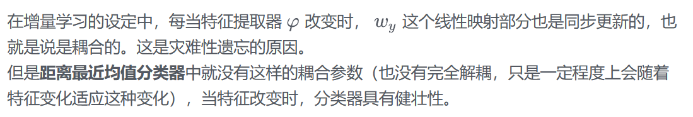

# iCaRL

iCaRL: Incremental Classifier and Representation Learning

主体思路：通过少量的就样本存储就可以完成对于新样本类别的增量学习

三大算法分类：

- 通过样本的最近均值规则进行分类（增量分类器）
- 基于羊群的优先样本选择（用于筛选保留旧数据）
- 基于知识提取和原型演练的表征学习（特征提取）

## 类增量样本均值分类器

可见这一步我们输入数据X，想要获得

首先我们对于输入的x进行特征的提取，之后我们对P也就是类代表样本（class exemplar sets）进行一个均值的计算，然后计算找到使得二者模最小（也就是和exemplar最相近）的y值作为分类结果。

输入是图像x，需要：图片集合P、特征提取器$\phi$ ，输出：距离均值最近的label

这里的下标1~t就是原始数据，旧样本

**为什么这样使用这样的分类器呢?**

## 表征学习（特征提取网络的学习）

分为三个步骤：每当有新的类别$y_{s,……,t}$进来

1. 将之前存储的examplar set和当前训练类别的数据取并集；
2. 使用之前旧的模型获得旧网络的最后一层的输出；
3. 采用基于**分类的损失**、**蒸馏损失**（与LWF很相似）之和的损失函数更新网络参数。

## 为新类选择exemplars

传入X，进行特征提取，计算X均值后对于1到m分别计算其使得上述模最小时候的$p_k$，最后输出P集合（有m个样本）

注意：在每次迭代的过程中，前面已经选择出的样本，须添加进总样本集中。
这样输出的每个类的样本的重要性其实是按照**从大到小的顺序排列的**（为删除样本埋下了伏笔）

## 将样本数量减少

这里直接减去最后小的那一些样本，相当于是最不具有代表性的那一批。

## 总体训练流程

在这里，m和内存大小以及类别数量产生了联系，其实m也就是每一个类别要有的样本数要和你想要新分类出来的类别数和电脑显存有关系，$m = K/t$，然后对于前面已有的样本代表我们一直进行减少的操作，对于之后新生成的类别进行构建操作，最后形成新的样本代表集合

[iCaRL:增量分类器和表征学习 - 知乎 (zhihu.com)](https://zhuanlan.zhihu.com/p/447254171)