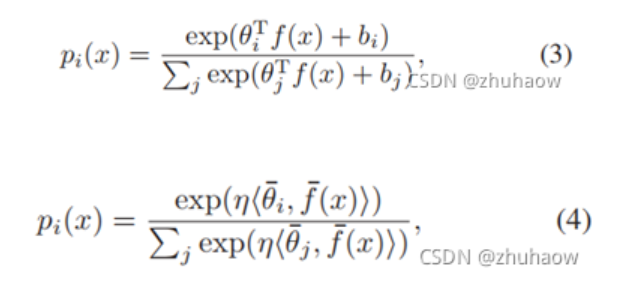
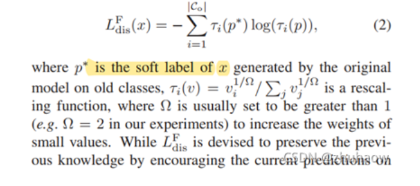
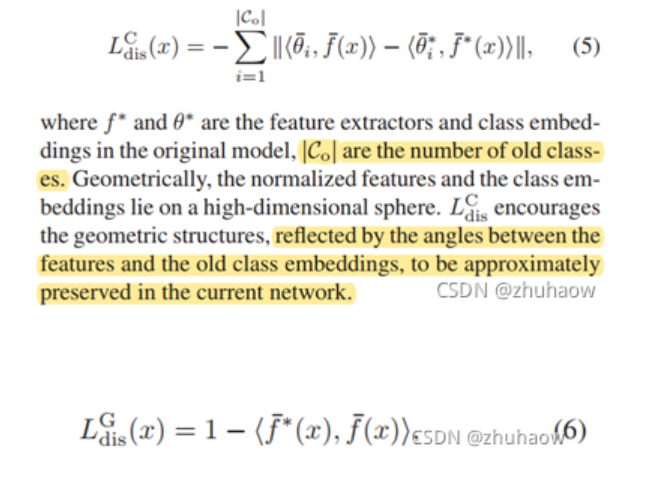
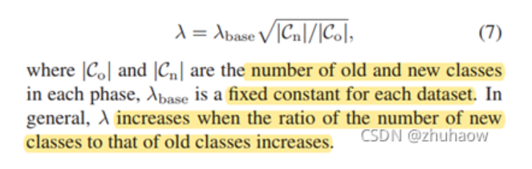

# Learning a Unified Classifier Incrementally via Rebalancing

## Overview

本文定义了增量学习任务中存在的三个问题：

1. Imbalanced Magnitudes
2. Deviation
3. Ambiguities

并提出了对应的解决方法：

1. Cosine Normalization
2. Less-Forget Constraint
3. Inter-Class Separation

可见在新加入的样本embedding向量与原来的对比后，发现新的向量往往偏大，这是因为往往注意力机制会注重新加入的表征学习样本，而且增量学习过程中旧样本的数量是比较少的。

存在的问题：

1. Imbalanced magnitudes: 新类别的Linear classifier weights 幅值会高于旧类别;
2. Deviation: 原有旧类别的知识没有能够很好地得到保留，例如，旧类别样本feature与分类器weights vector之间的；
3. Ambiguities：新类别的weight vectors和旧类别的weight vectors会很接近，没有区分度造成新旧任务间的混淆，主要是旧类别误分为新类别。
   

## 目的

定义出三个损失函数去约束Distillation-based的方法中存在的因新旧样本不均衡而导致的偏见问题。

### Cosine Normalization(CN)

Cosine Normalization的做法如下：

1. 模型分类器的权重weights进行二范数归一化
2. 输入分类器的feature进行二范数归一化。

这样原有的公式3中的分类器weights和特征f(x)相乘的操作，就会变成公式4所示，由于此时weights和feature都是归一化后的，两者之间相乘其实是在计算余弦相似度，那最后的分类结果就是在计算各个类别的相似度。

### Less-Forget Constraint(LC)

调整好新旧任务分类器的权重后，现在要考虑如何维持旧任务的数据和记忆，即通过下述公式计算的蒸馏损失。

原有的iCarL (baseline)中的蒸馏loss是针对模型输出进行蒸馏的，但是呢，由于cosine normalization后，模型输出的是余弦相似性，就可能会发生图4中的情况。

即如果class embedding和features整体发生偏移，可能会出现class embedding和features之间的余弦距离没有发生变化，但整体已经发生明显偏移的情况。

因此，提出了约束旧样本在新旧模型中输出特征之间余弦距离的方式，让新旧模型输出的**特征尽可能相近**，如下述公式所示：

$L^C_{dis}(x)$相当于是embedding和feature之间的夹角，而$L^G_{dis}(x)$相当于是features之间的距离。

此外，作者还提出adaptive loss weight的思想，认为随着增量学习任务的进行，蒸馏的loss weight也应该随之变大。

### Inter-Class Separation(IS)

为了避免新旧任务之间的混淆现象，应该尽可能加大两个任务之间的区分度。作者此处用了一个rank margin loss，去使得旧任务样本的GT类别输出尽可能大于新任务类别的输出，避免旧样本错分为新样本。

对于新训练的任务，需要增加其与原任务的区分度，避免新的样本在训练过程中被当作旧样本训练。

整体损失函数：

