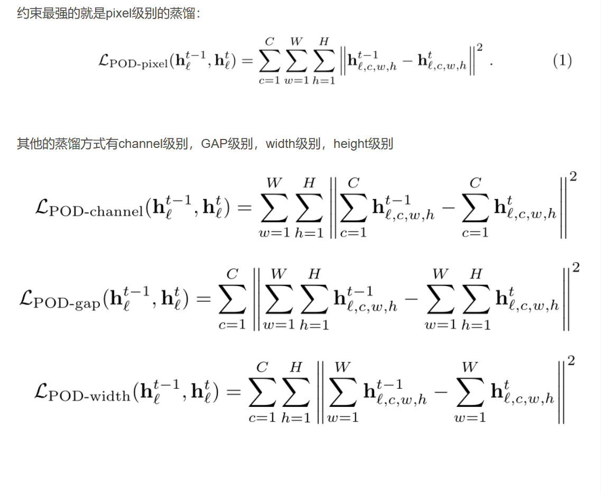
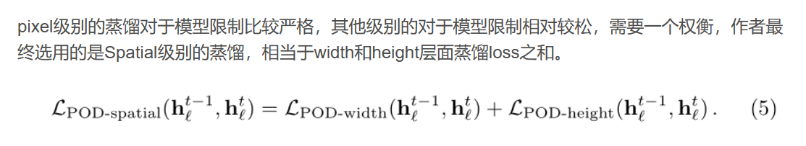

# PODNet: Pooled Outputs Distillation for Small-Tasks Incremental Learning

## 贡献点

PODNet受到representation learning的启发。贡献点有两个

spatial-based distillation-loss, 基于空间的蒸馏loss,改进了feature的蒸馏方法
representation comprising multiple proxy vectors, 代理向量，改进了模型的分类器。

## 方法

### pool类型

已知的池化模型有以上几种，分别是根据不同的维度来进行池化，GAP即global average pooling,相当于除了channel外的所有通道进行pooling.

## POD（Pooled Outputs Distillation）方法

在模型训练加入新的类别时，模型必须保留所有类别的知识，模型对于旧类样本的记忆是有限的。

假设分类过程定义为：$\hat{y}=g(f(x))$

h=f(x)定义为特征提取过程，g()可以被定义为分类器。这也是增量学习中常被采用的结构，即双阶段，一个分类器阶段，一个特征提取阶段。

本文提出POD(Pooled Outputs Distillation)算法，不仅将蒸馏用于特征提取阶段h=f()的最终输出，也应用于f()的中间过程(intermediate layer)。

即特征提取中的每一层都作为中间结果，用于kd，上标t表示task t,下标L表示模型第L层。

假定中间层的输出：$h^t_{l,c,w,h} = f^t_l(\cdot)$

