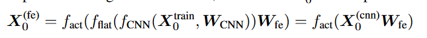

# ACIL: Analytic Class-Incremental Learning with Absolute Memorization and Privacy Protection

目前CIL存在的两个问题：

1. 灾难性遗忘
2. 旧数据读取涉及到隐私保护的问题

已有的工作试图解决上述问题：基于GAN网络的旧数据生成（2），基于回放的CIL等等（1）

## 方法

## The Base Training Agenda

### (a) Base training via BP

其中，$f_{CNN}(X,W_{CNN})$是卷积神经网络，涉及到反向传播参数$W_{CNN}$，之后是flat扁平化来将特征减小到一维大小，之后进行全连接层FCN，最后softmax得到分类结果Y

### (b) Analytic Re-alignment Base Training

在扁平化之前的操作与上述一致，之后引入了一个feature expansion (FE) process，通过增加一层全连接层来实现特征的增加，因为分析学习往往需要更多的特征。

最后使用激活函数（ReLU）来实现概率的分布。

最后，我们可以得到增加的特征层$X_0^{(fe)}$与$Y_0^{train}$之间的关系：

用于更新$W_{FCN}$权重的话，我们将上述式子进行变换得到：

## The Class-Incremental Learning Agenda

得到了上述模型的基本架构后，我们带入具体的样本X与分类结果Y

进行简化后可以得到：

对于其中求导项：

最终可得：

注意到这里的$R_k$代指的是参数的求导，那么这里就很巧妙地完成了数据加密的步骤，因为求导如果要恢复只能积分，然而这肯定缺失了如常数项这类的信息，同时这个模型也保留了对于之前学习的绝对记忆，如论文中所说。

## Analytic Learning

分析学习围绕在反向传播时遇到的梯度消失/爆炸问题展开了讨论，同时研究在多轮训练中的分散性问题。

由于在其中使用了矩阵的逆，则也可以称为伪逆向学习。

example:

Radial basis network训练参数，在第一层进行核变换后使用least-squares estimation最小二乘法来训练参数。

之后在多层分析学习网络中将非线性网络转变成线性分段，此时可以做到在一次epoch训练的模式中分析适应LS最小二乘法的方法。

