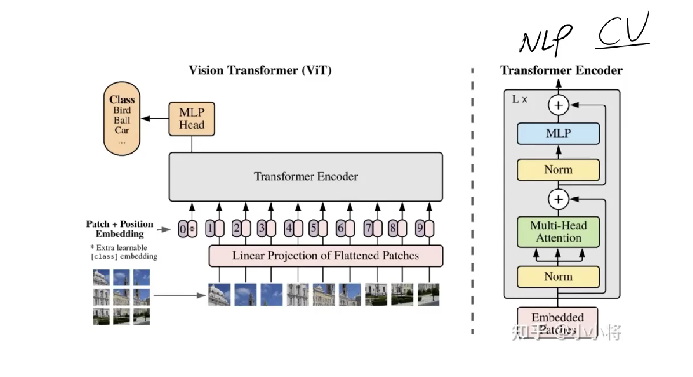
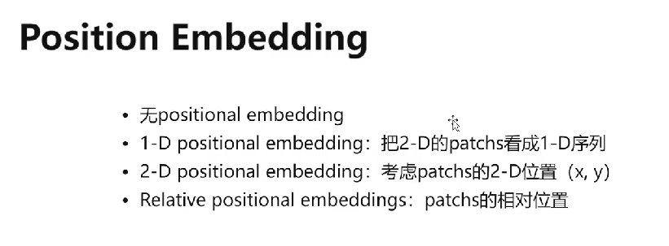
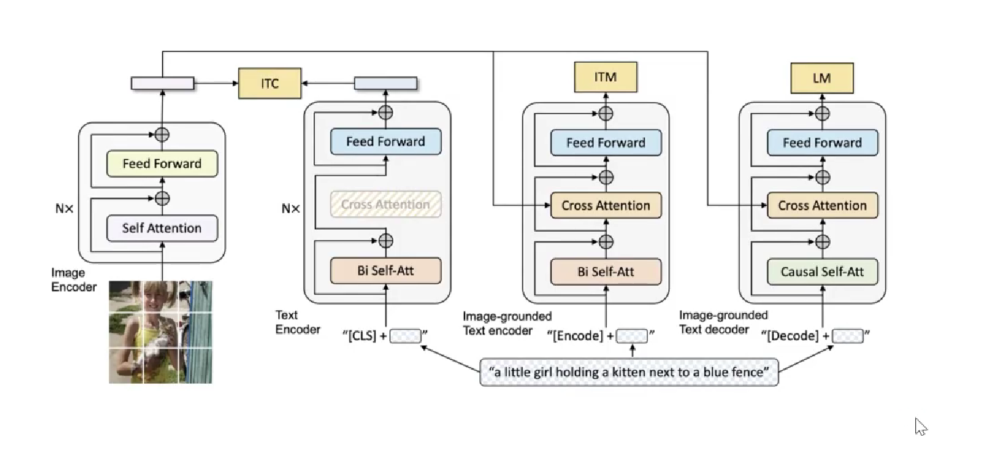
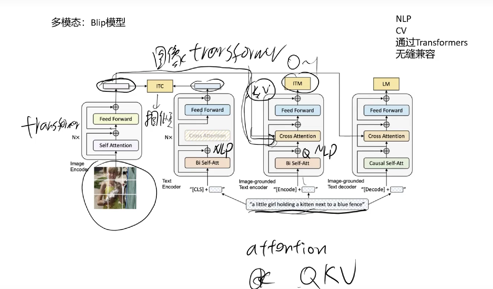

# 多模态入门：ViT模型（2019）

ViT全称为Vision Transformers，Transformer处理视觉开山之作

之前的computer vision如分类任务都是用CNN去做的，在transformer出来后它也可以用来做cv

相比于正常的Transformer Encoder，ViT的结构首先将图片分成多个pattern，例如原图像为900×900，那么分成的pattern大小就是300×300，这个时候直接转换为向量的话太大（九万维），所以这里采用一个线性投影的操作，乘以W变成低维向量（降维），得到embedding向量。position embedding加入可以参考原transformer的理论。最终图像特征（向量序列）输入encoder，进行MLP多头注意力机制模型，之后全连接层得到各类别。

加入position embedding方法：

上图为1-D positional embedding方法（只有一维的像素编号），如果说是2-D方法则是由列向量和行向量与原图像特征相加得到。最后得到测试发现1-D效果要比2-D要好。

## CNN与Transformer比较

同等效果下，Tr的参数量比CNN要大

CNN为局部感受野，如果要和很远的信息发生联系，则需要多层网络，模型深度就要提高

Transformer的全局特征会更好，直接发生全局联系。

CNN需要配合池化，不断降低特征维度，Transformer无。

Transformer非常耗费参数，因为其参数并不是共享的，主要大在MLP全连接层上。

Transformer依赖于强大的算力。

**Transformers最大的优势：NLP也用Transformers，这导致CV和NLP可以结合起来**

纯CV场景还是用CNN，毕竟轻量化，需要的算力较小。

# 多模态：Blip模型（2022）

这里输入了图像和语句，目标是比较它们之间的向量的相似度。

**这里将图像和语言向量同时融合到了NLP中，最后ITM输入0或1代表是否匹配。**

nlp和cv通过Transformers无缝兼容。

图片经过image encoder后输入K和V到Cross Attention部分中，同时语句通过Bi Self-Attention输入Q到Cross-Attention，通过这一步后得到CV的信息。

Blip2.0在2023.3提出，为目前最强模型，最终可运用于文生图。

