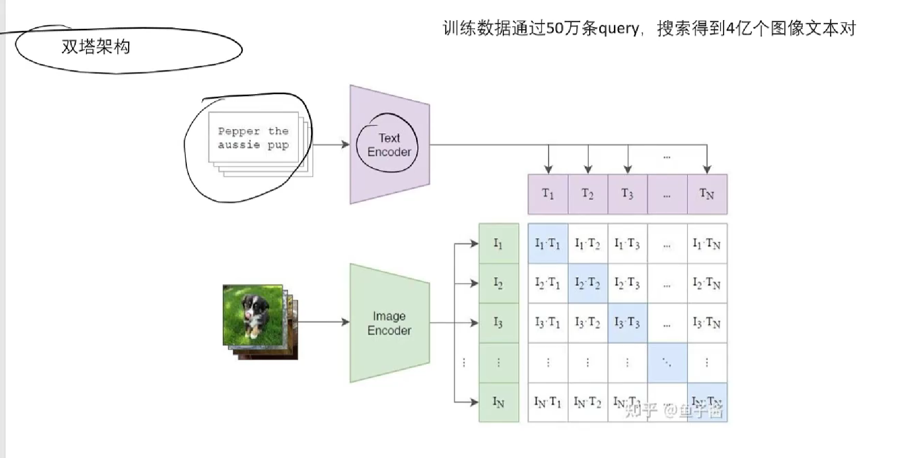
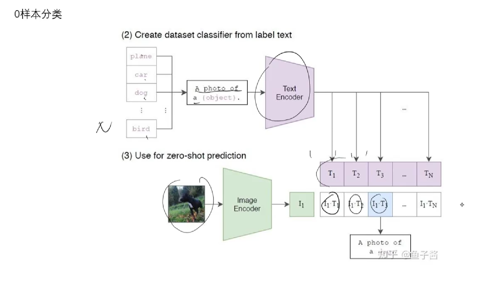
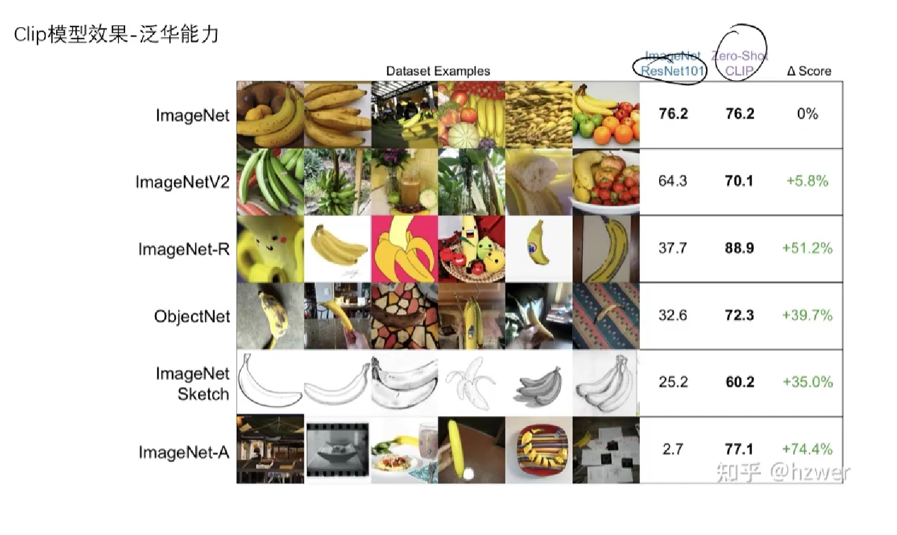
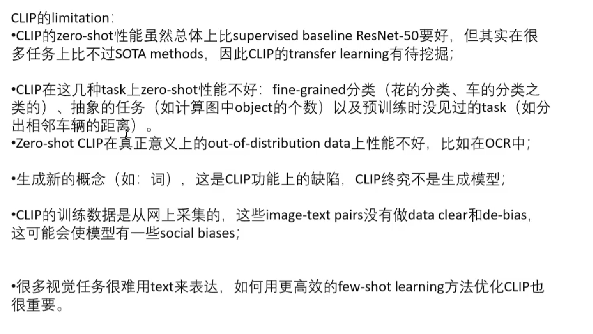

# Clip模型

任务上来说也是图片分类

现在的经典分类模型问题：

1. 类别固定
2. 模型只能胜任一个任务，迁移到新任务很难
3. 类别互斥，比如说一张图片里面有两个已知的类别，最后由于softmax输出概率，没法很好的区分和决定
4. 如今CV数据集标注劳动比较密集，成本较高
5. 模型泛化能力较差

## 双塔结构

分为两个encoder，text encoder（可用bert、gpt）和image encoder（resnet、vgg、ViT），将文字和图片提取出向量，最后能做到每一个文本都对应一个图像，则对角线上的向量内积为1，其他的地方都是0。

则相对来说正负样本都是在batchsize内部构造出来，预先标注只需要标注文字图像对。

batchsize和训练样本都具有随机性。

如果batchsize过小，则负样本过少，训练样本不佳，这里的batchsize = N，决定了矩阵的大小，相对来说看的还是正样本（对角线）和负样本（除对角线外位置）的比例；如果batch太大，且类别数比较小的时候，负样本容易出现误差。但是在分类的类别较大时则小概率出现误差。

## 0样本分类

首先用文本分类器得到T向量，之后图像分类器得到I向量，将I向量和各T向量相乘，内积最接近1者为正确标签。

CLIP模型相比于普通模型来说，对于更多抽象或者多风格的图片来说泛化能力更强，识别率也更高。

CLIP能够做zero shot识别，且效果不错的原因在于：

1. 训练集足够大，zero shot任务的**图像分布在训练集中有相似的**，zero shot任务的**concept在训练集中有相近的**
2. 将分类问题转换为检索问题

CLIP的限制与缺点：

在一些细节的类别上可能没法做到很好，比如说一些花的类型，车的品牌等。

有一些比较不符的图片数据也可能造成训练不准，因为这个模型的训练数据没有做去噪

有一些难以用文字表达的图片可能造成训练不准，需要大模型的辅助。

