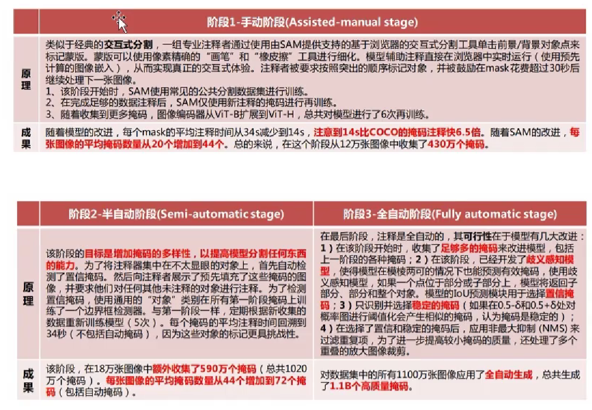

# SAM(Segment Everything)

主要任务为分割

[Segment Anything | Meta AI (segment-anything.com)](https://segment-anything.com/demo)

可以实现图像中不同元素的分割（对于任何没有见过的物体也可以实现快速分割）

此模型的厉害之处在于运用了0样本学习。

之前的分割方式必须要提前有相应样本的学习才能够实现分割，如果有一个没有见过的物体是无法实现分割的

SAM模型的分割出发点

首先需要给模型一个具体的分割任务，需要分割什么？比如在网站中鼠标移动到的位置。

之后需要一个支持灵活提示的模型，类型可以是文字，point，box，mask，mask即为去除掉一部分依然可以识别。

数据上使用了1100w张图片，10亿的mask（分割结果）

## 模型架构

前四者作为prompt传入，需要被识别的图片为image，最终结果输出分割完的物体

具体来说，prompt经过encoder之后转换为向量序列，比如poit就是两个点的坐标向量，mask就是一个图片区域像素的所有向量集合，text可以调用clip等大模型来得到向量序列。这些prompt都是可以同时输入的。

在经过mask decoder之后可以得到三个结果，且分别有各自的分数，这三个结果就是不同的分割区域。

image encoder特征提取用的是transformer，后续需要进行特征融合和多模态，其通用性的接口方便后续操作（优于CNN）

## 具体结构

## 数据引擎

数据来源有11m的图像作为数据集，得到10亿+的分割结果。在训练阶段分为三个部分：

1. 手动阶段：拿现有的数据集（已标好的小数据集）训练一个粗糙版的SAM
2. 之后拿粗糙版的SAM分割新数据，同时进行人工修正，重新训练模型，扩大参数量
3. 对以上两步进行反复迭代

第二步已经大大减小人为劳动量，如果有分割不出来的图像，则重新给人为来标定，之后再重新训练。

