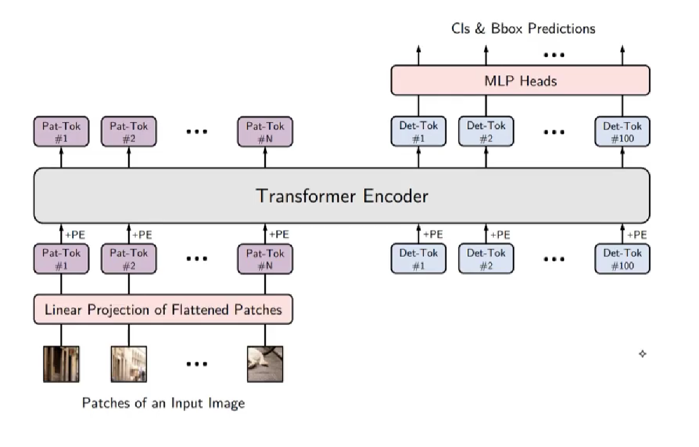
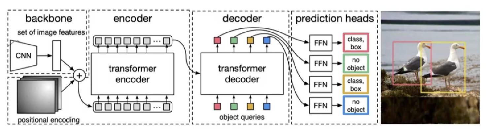

## Yolos & detr

### Yolos模型（2021）

在普通的视觉识别任务中，传统cv用yolov1~v7，在transformers领域中用yolos

在左侧为视觉目标产生的特征向量，右侧为特殊向量，也是可以学习的（最多100个），之后经过encoder后传入MLP，最后输出分类预估。

### detr

detr相对于yolos的区别就是其首**先用CNN提取了一部分特征**，之后加上位置向量，传入encoder，这里首先用CNN提取特征，后面还有一个decoder进行解码。

### 优缺点

目标：目标检测

优点：zero-shot 零样本分类

缺点：模型训练的时候要事先知道所有的类别，也就是说开始训练的时候确定的一些目标就是后期单独无法修改的，要改的话就要重新训练。

目标检测的类别可以不在训练样本中出现

