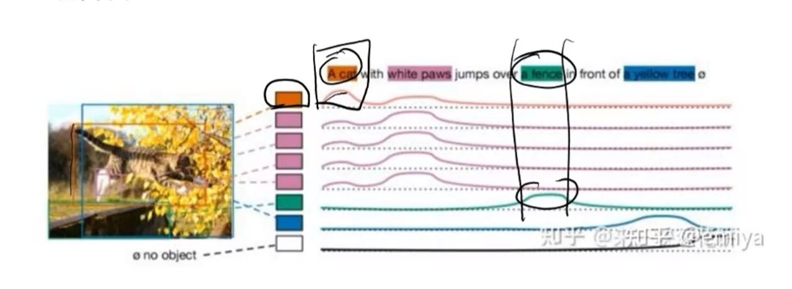
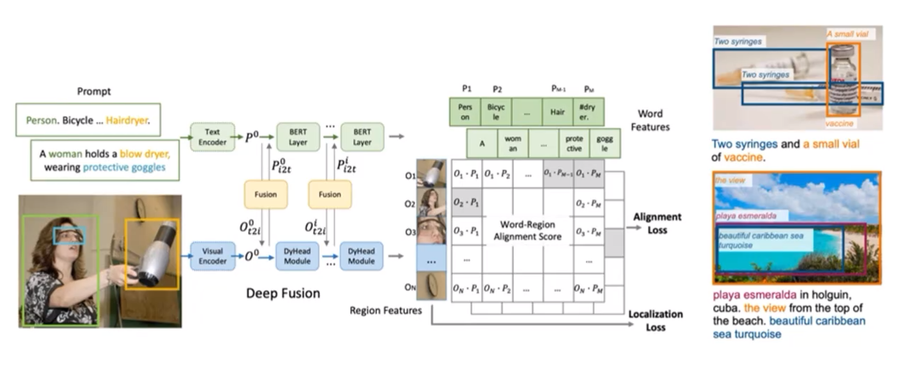
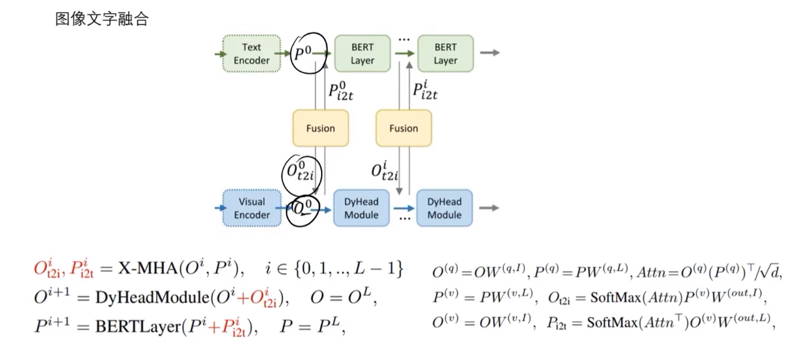
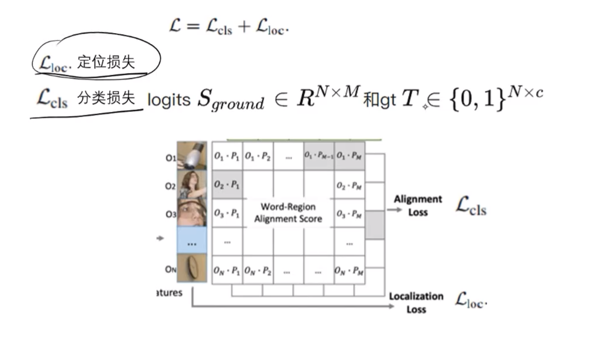
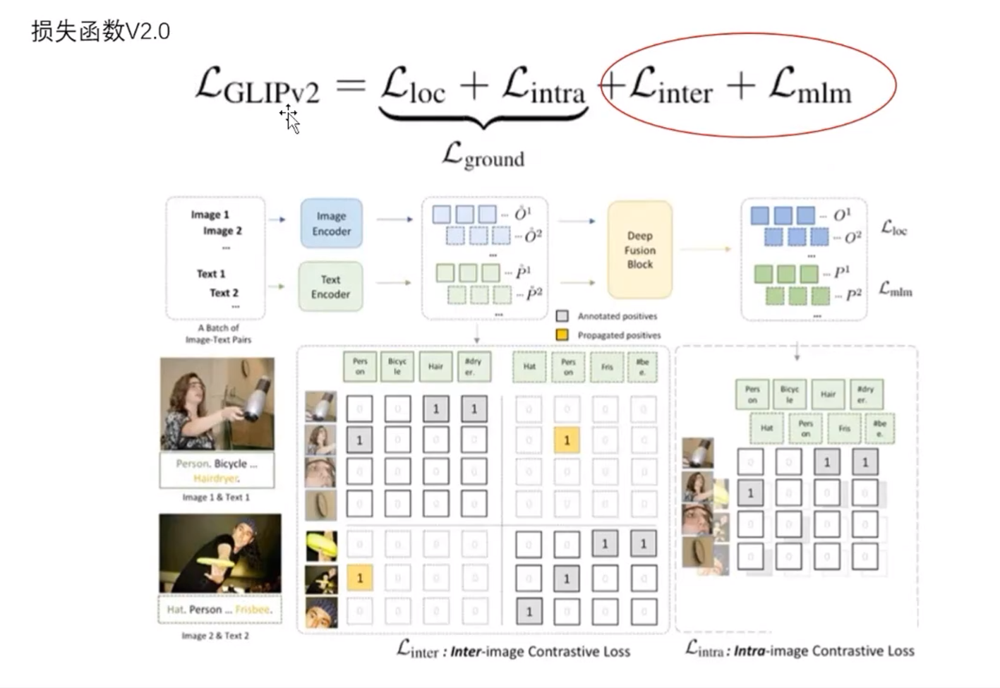
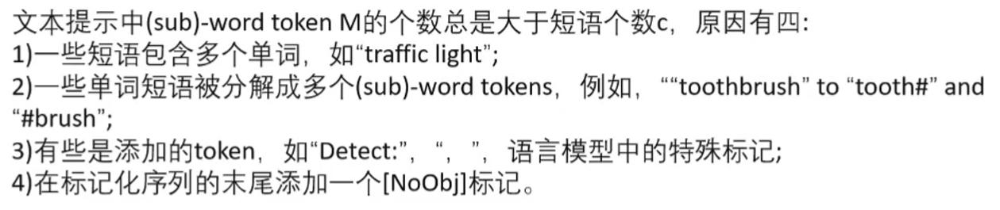
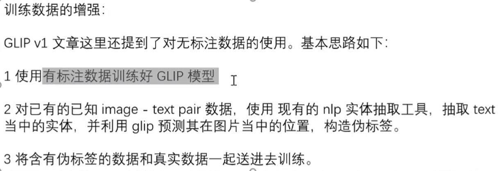

# Glip

模型出发带你点：对于一个图片和一段和该图片匹配的文字，**找到文字当中的指定短语所对应到的图片当中的检测框**。对应到了一种短语和图片当中的检测框的细粒度的匹配关系。

## 模型框架

对于图片，有上述的一句话来描述，之后将这些文字通过文本编码器。

对于图像，先用目标检测（传统），先将框检测出来，但是不分类。之后把目标框区域传入视觉编码器。

二者的特征向量经过多层编码，以及融合，之后传入双塔结构。

模型的关键点在于文字图像融合：

X-MHA为多模态多头注意力机制。

对于Encoder中的Q,K,V，Q用来计算相似度，视觉任务中加权求和文本，文本任务中加权求和视觉$$SoftMax(Attn)P^{(v)}W^{(out,I)}$$

此模型借鉴了Clip模型中的双塔结构模型。

出发点是通过短语匹配的方式来进行检测，而不是通过分类的方式

优点：可以进行0样本学习。

没有类别的概念，全部都是匹配，所以训练数据集的量可以做的很大

可以方便的将任务迁移到开放式目标检测任务中，只需要将Prompt短语进行替换即可适应任务。可以扩大训练集，让模型见多识广，也因为见多识广可以实现0样本学习。

**视觉向量和文本向量是在同一个空间，因为都通过Clip模型提取。**

## 损失函数v1

定位损失为框的位置差距，分类损失为匹配的准确性

## 损失函数v2

$L_{inter}$：负样本只在（一张）图片本身中出现并提取

$L_{intra}$：正负样本跨图片

如图，图片中的女人有可能是和另一张图片中的负样本匹配，这样的目的可以扩大训练集

$L_{mlm}$：通过图片内容学习文本，输入图片，直接预测文字，然后计算损失，类似于Bert Mask，这样可以加强文本理解的能力。

注意事项：

traffic light可能对应两个token从而对应两个向量，甚至一个单词也会对应多个向量，则最后需要把他们的得分都相加。

最后NoObj类别相当于所有类之外的“其他类”用于划分不在匹配目标类的信息。

## 训练数据增强

0样本学习对于数据量要求很高

对于有标签数据（公开少量）训练好的模型，然后将已知的文本-图像对使用nlp进行text的实体抽取，然后再用训练好的Glip模型预测其实体在图片中的位置，构造伪标签，实现数据的增强。

这里可以参考SAM的数据增强办法。

