# Stable-Diffusion

通过文本来生成图片

## 模型架构

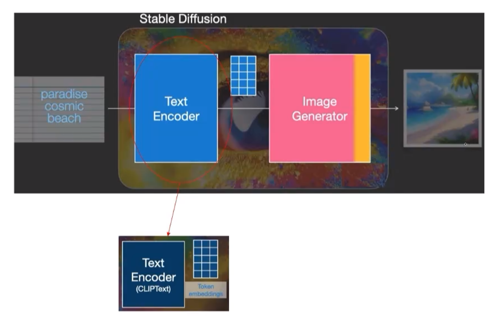

在输入了文字之后，传入Text Encoder，然后形成向量（用Clip编码器）

向量之后传入Image Generator后生成图片

## Image Generator

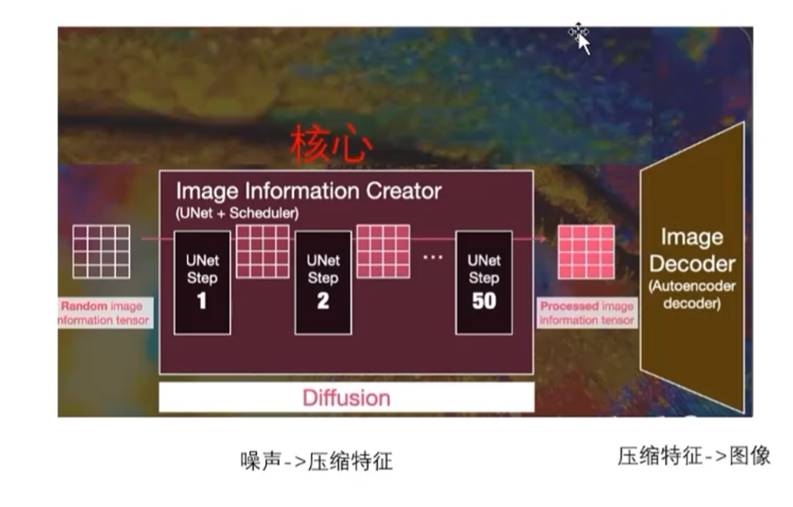

首先传入噪声图片（随机生成），每一个像素点都是随机生成的。通过Image Information Creator 进行信息的产生/生成，形成压缩特征，最后用一个decoder形成最终想要的图像。

### Image Information Creator

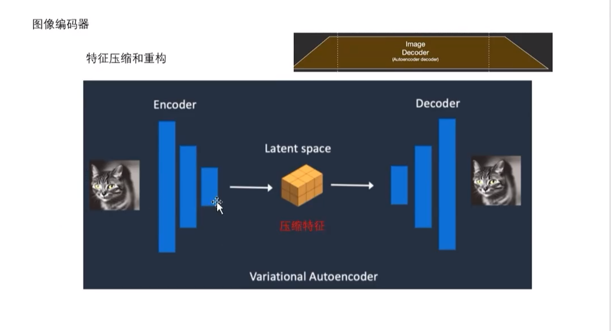

在左侧原始传入图片中，可见有一些大量冗余的点，即图像去掉这些点后依然不影响图像的信息存储，encoder过程为压缩，decoder过程为恢复。

在训练过程中，encoder和decoder一起训练，但是真正用到的只有encoder。

## 前向扩散

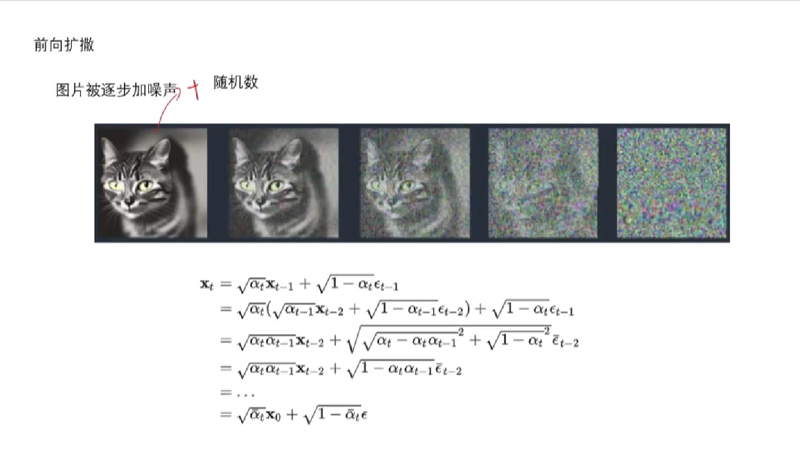

在过程中，图象被不断加入噪声，$x_t$为权重，$\epsilon_{t-1}$为噪声。

在这里不用考虑噪声分布，只要能够还原就行。

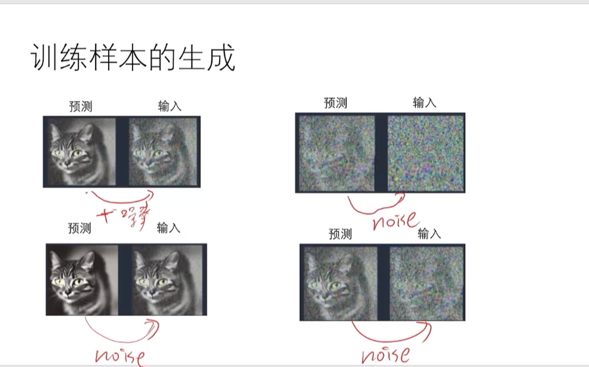

通过将一个图片进行加噪处理，与其本身构成一组训练样本

目标：从无到有生成一张图片，从一张随机噪声中生成一张图片。

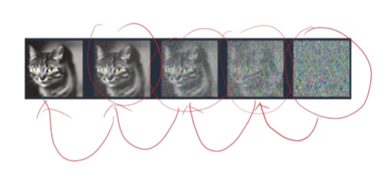

用噪声图片预测清晰的图片可能比较复杂，则采用以下的方式：

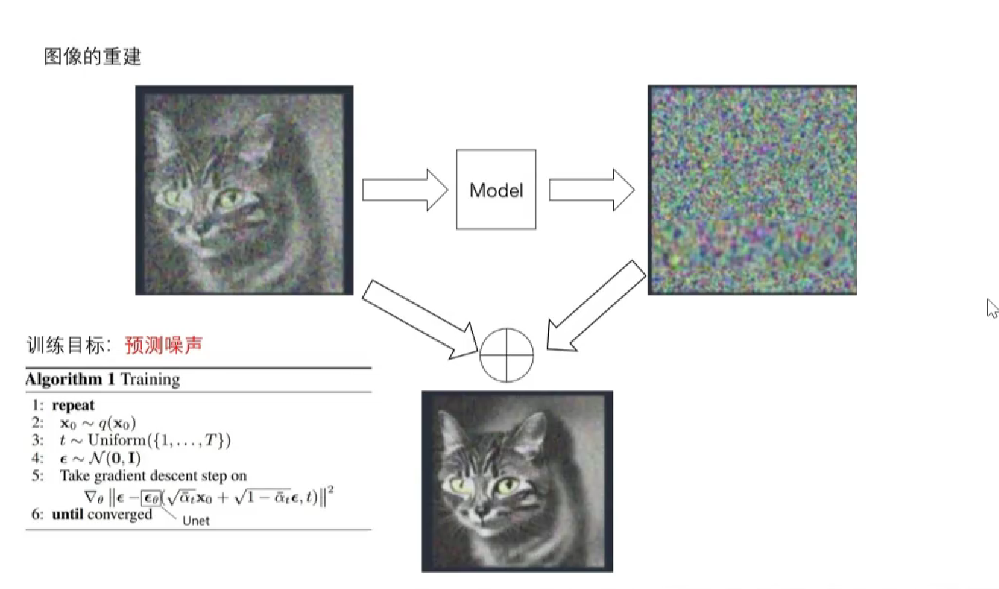

首先存在一张加过噪声的图片（左上），预测加入的噪声（右上），二者相加得到清晰化的图像。

Model：输入一张带噪声的图片，预测一张所含噪声的图片。

### 逆向扩散

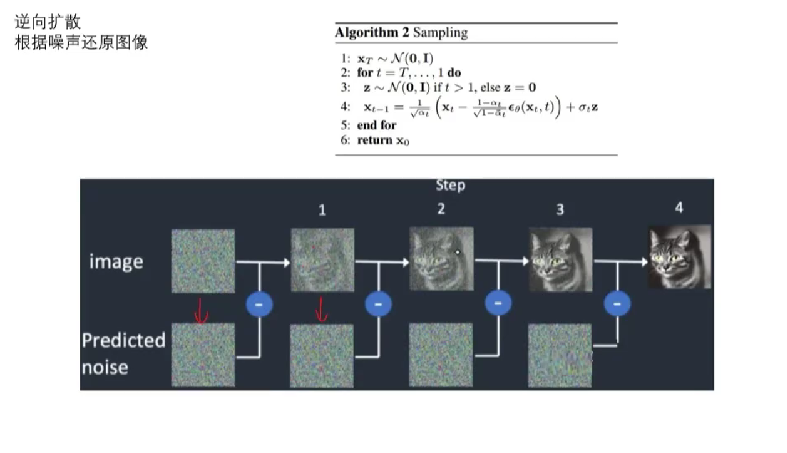

### Unet模型

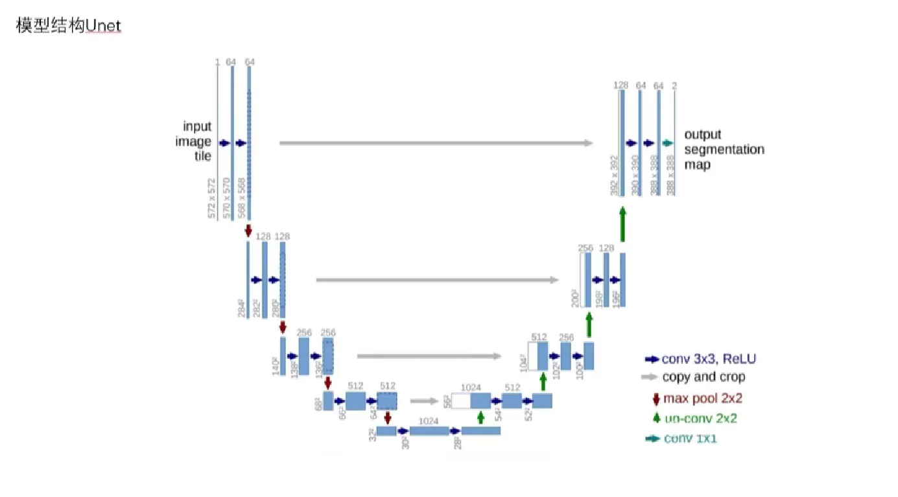

序列通过两个CNN，再经过一个池化层，重复上述的操作，最后得到32×32的序列，之后进行恢复。为了防止压缩时的信息损失，在恢复的过程中，对应原压缩过程中的序列也会传入相应阶段的恢复过程（灰线）。

最后输入和输出的尺寸保持一致。

### Stable Diffusion 下的Unet

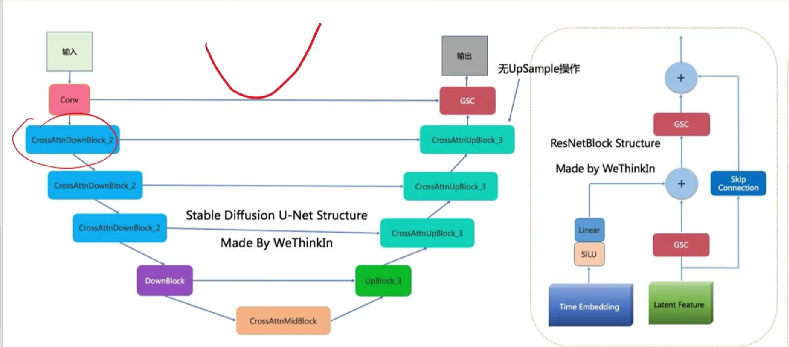

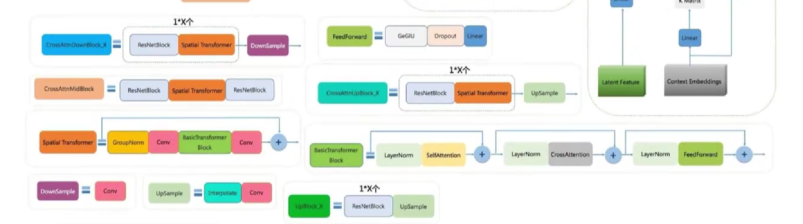

原来的CNN结构被替换成交叉注意力机制下的神经层。

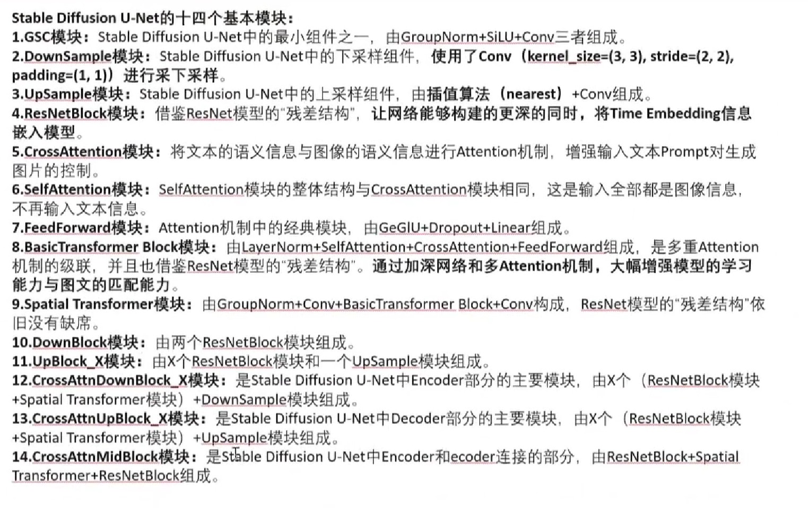

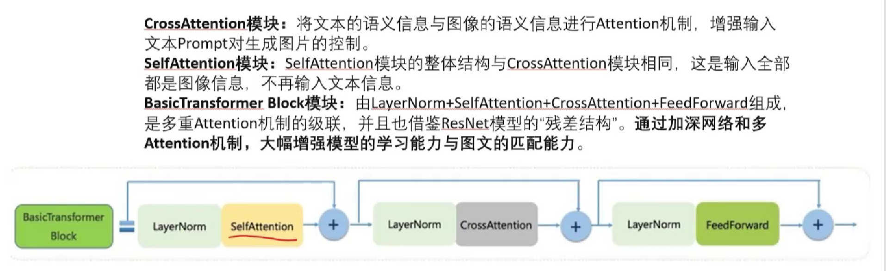

其中CrossAttention目的是将图像特征和扩散学习特征进行融合。

用Transformer做CV好处是可以用Attention机制来获取外部信息。

